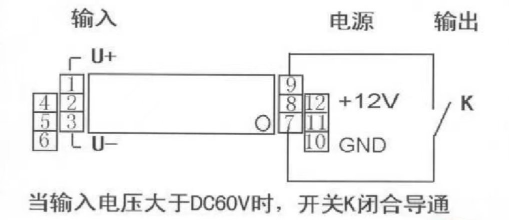

# 电压变送器

简单理解就是能**把被测电压转换隔离输出**。

隔离指的是高压与低压隔离，转换输出的可以是数字也可以是模拟信号，他是一种传感器。

## 我们使用的60V电压变送器

他可以在电压大于60V时闭合一个开关，低于时断开，**很明显他的输出是数字开关量**，类似于继电器作用。

我们把1、3号脚接在电机控制器供电两端，认为测量的就是电机控制器内部电容的电压，然后7、9号脚之间就相当于一个继电器了。