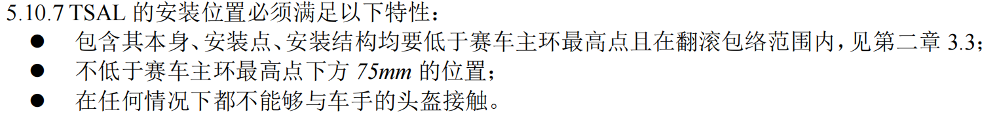
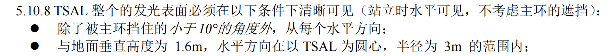
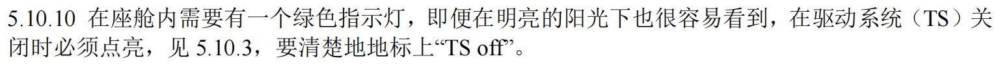

# TSAL总览

TSAL是个什么？

## 两种颜色指示灯

TSAL即驱动系统状态指示灯，用于指示启动系统状态，TSAL本身有红灯和绿灯，他们只存在如下状态

- 红灯—— 2-5Hz 50%占空比闪烁；熄灭
- 绿灯—— 常亮；熄灭

简单的来说，在**仅低压打开的情况**下绿灯常亮，**上高压电后**红灯闪烁，**相关信号线出现故障时**两灯熄灭。

:::info注意

但是注意，TSAL**不允许**出现**抑制两灯同时亮**的电路，也就是说他们俩的**控制回路必须独立**，红灯闪烁和绿灯亮并不是互斥事件（当然正常情况下不可能两者同时亮）

:::

## 放置位置

TSAL的一般就放置在主环的下方，具体的规则要求如下[^1]：

> 

## 制作方法

TSAL一般都是直接买现成的灯带，把绿灯和红灯缠在一起，自己绘制电路板吃力不讨好，防水还不好做。规则对TSAL发光还有要求，在周围一整圈内都要能看到，在阳光直射下也要清晰可见

> 
>
> 

## 前面板上的绿灯

另外因为TSAL放置在驾驶员脑后上方，实际上是给旁边的人看的，提醒赛车驱动系统已经使能了，大家保持距离，但是赛车手不太好看到，所以在前面板上我们还需要装一个小的指示灯，这是一个绿灯，和TSAL里的绿灯保持同步就好

> 

[^1]: 这里使用的是2023版的规则