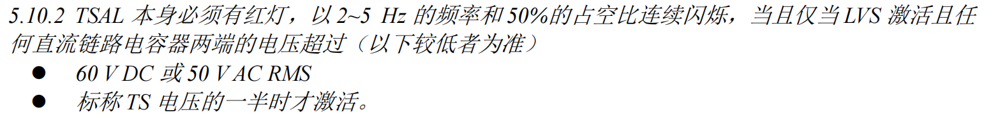
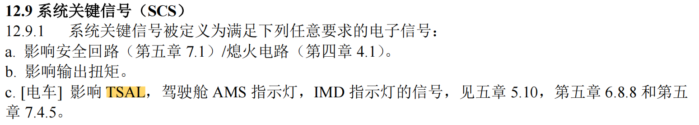
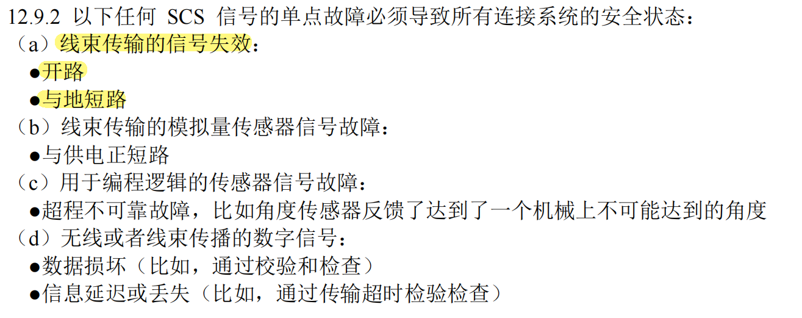
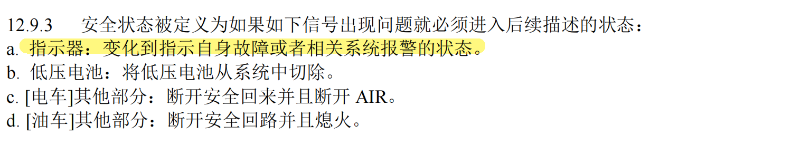
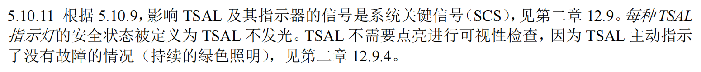
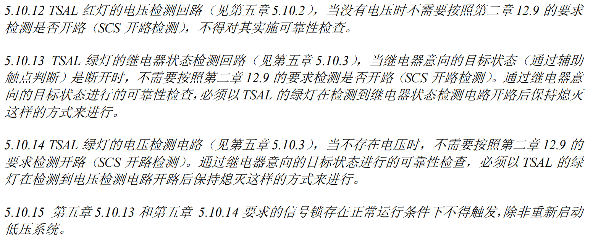

# TSAL判断逻辑

TSAL就是个灯，那他们啥时候亮呢？

## 概述

如[总览](./TSAL_Intro.md#指示灯)中所述，TSAL的控制回路必须独立，所以我们在设计电路板是实际上是两个相对独立的部分。

## 红灯部分

> 

因为我们的高压电池满电接近580V，其一半远超60V，所以显然是60V更低，所以这里只需要检测电容两端电压是否超过60V，就可以判断红灯是否应该亮起，**直流链路上的电容**只有电机控制器[^1]里的电容，但是我们电机控制器是直接买的，电容内置在控制器里，所以我们只能在外面的[放电盒子](../Basic-Technology/放电盒子)里放了个**60V[电压变送器](../Basic-Technology/%E7%94%B5%E5%8E%8B%E5%8F%98%E9%80%81%E5%99%A8)**用来检测这个电容的电压。

:::tip

看起来，红灯的信号好像只需要两种状态就行，逻辑并不复杂。但是很不巧的是，所有影响TSAL的信号都是系统关键信号（SCS），规则对这类信号有着几乎变态的要求，所以我们的板子和逻辑就会做的很复杂

:::

> 

那么他对TSAL有什么要求捏

> 
>
> 

对号入座一下，TSAL的信号是线束传输的信号，所以我们要判断他不能开路或对地短路

TSAL是一种指示器，他需要变化到指示自身故障的状态，这个状态在规则里有定义

> 

也就是说如果控制红灯的信号线对地短路或断路了，我们只需要不让他亮就好了。

:::note

至此，我们知道红灯需要：

- 在电容两端电压到达60V时闪烁
- 在电容两端电压低于60V时熄灭
- 在信号线故障时也熄灭

:::

## 绿灯部分

> 

AIR继电器在高压电池的正负极各有一个，所以总共是4个继电器，类似于红灯

:::note

绿灯需要：

- 在这四个继电器都断开时常亮
- 任意一个继电器闭合时熄灭
- 信号线故障时也熄灭

:::

## 规则里晦涩难懂的部分

> 

### 什么是电压检测回路？

因为有的车队是自制电压检测回路，但是直接买产品也是被认可的，所以我们简单的采用了60V电压变送器，相当于电压变送器就完成了整个电压检测回路的工作。

### 什么是继电器状态检测回路

我们采用的是通过辅助触点判断的方式。高压继电器为低压系统预留了一组辅助触点，他与高压触点同开断，所以可以通过辅助触点判断继电器是否闭合，这实际上是一种间接方法，因为没有考虑触点黏连、继电器损坏的情况（虽然这种情况也太离谱了）。

辅助触点本质就是个开关，为了传输有用的信号，我们还需要搭一些外围电路，这些电路就是继电器状态检测回路

### 什么叫不存在电压时不需要检测开路

部分车队给出的解释是没有上高压时，不需要检测信号线的开路，我认为不太对，毕竟在上高压之前就发现信号线断了岂不是更好，这样说很奇怪很牵强。但是我也不能解释很好，这块还在问……

### 什么叫当通过辅助触点判断时不需要进行开路检测

这里检测的开路应该是指对继电器那根线的开路检测，因为如果通过辅助触点判断，正常情况中包括了开路，无法区分正常和异常开路

### 什么叫可靠性检查

应该就是信号线不能断路或者短路

### 什么叫信号锁存不能在正常运行时触发

也就是说这个锁存只能通过重启来解除，锁存的内容应该就是可靠性检查中的错误信号

[^1]: 电机控制器是独立于华海的一套系统，主要功能是把直流电变成三相交流电，并且控制输出驱动电机

