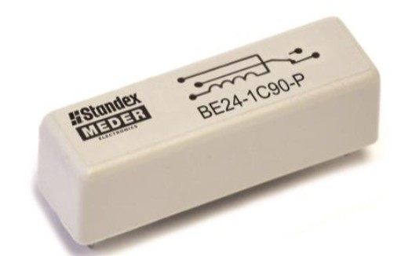
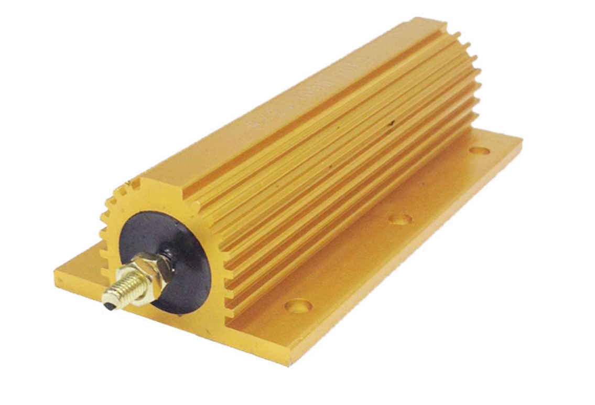
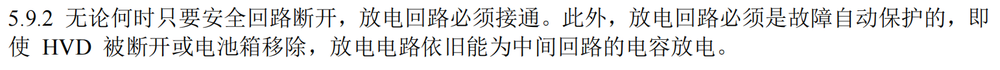
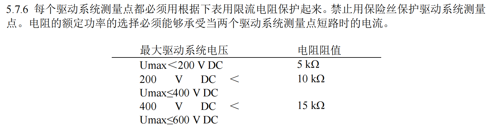

# 放电盒子

虽然但是，这个名字实在是太土了

## 组成

顾名思义，放电回路就放在放电盒子里头。当然他也不只有放电回路，放电盒子主要包括了下面几个部分

- 一个3D打印的外壳
- 放电回路
- 人体保护电阻
- 一个60V[电压变送器](./%E7%94%B5%E5%8E%8B%E5%8F%98%E9%80%81%E5%99%A8)

## 放置位置

放电盒子在**车尾左侧**，用两个螺丝固定在了车尾内壁上，外壳是一个白色的3D打印盒子（这个盒子还是当时川川画的）

:::note

这个位置主要是因为他需要连很多高压线，如果之后有更好的位置其实可以改一改

:::

## 放电回路

众所周知，电机控制器里是有一个电容的，这个电容导致了很多问题，包括需要预充回路和放电回路，前者在电池箱里头，后者就在放电盒子里。

当车子要下高压时，放电回路会自动闭合，电容里残留的电荷会通过一个很大的铝壳电阻耗散掉，如果没有放电回路的，据说会需要10+分钟的时间电容里的电压才会降到60V以下。

### 具体电路

他的电路简单到不能再简单了，就是把电机控制器供电的两极引出来，串进一个继电器和一个电阻。

继电器要求使用干簧常闭继电器，耐压高且稳定。

电阻用的是铝壳电阻，散热快功率大。

:::note

上面的图片都不是实际车上用的，从网上随便找的（）

:::

:::caution注意

> 

继电器的供电直接来自安全回路，也就是说安全回路有电时放电回路断开，安全回路断开时放电回路接入（常闭式）

另外，安全回路的末端是高压系统主开关，因此在关闭高压后放电回路就会自动接入。

:::

## 人体保护电阻

虽然但是，我没有在规则里找到这个名词，他本质上就是个限流电阻，是和[驱动系统测量点](./驱动系统测量点)在一起出现的。

实际上他就是串在电容端到测量点的电阻，需要注意的是电容的正负两极各需要一个保护电阻，所以在放电盒子里有两个，我们使用的都是很小的铝壳电阻。

## 60V电压变送器

关于[变送器的解释](./电压变送器)其他文档有写，他和[TSAL的红灯逻辑](../TSAL/TSAL_logic#红灯部分)有直接关系
