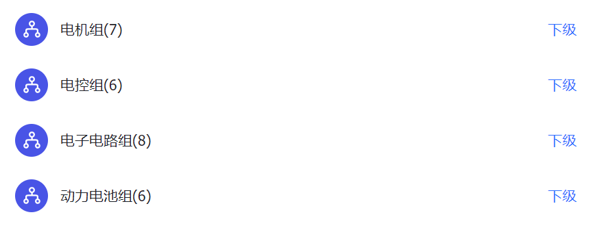

# 一、总览

总体上介绍一下电子电路组的任务和作用

## 概述

和很多其他车队的朋友聊过，其实大多数车队的电气部分不会分的这么细致，也没有“电子电路组”一说，这个名词一听起来太宽泛了，有点让人摸不着头脑。

我们都知道咱赛车电气部分的核心是三电，也就是是电池、电控、电机，我们车队自然也有这三个组，但是多出来的电子电路组绝对不是不重要，反而承担了很多连接和撮合的作用，它相对来说更为基础，但也更接近工程实际。

:::tip 车队电气组架构图

:::

## 任务举例

比方说，我们车上用的主控叫`华海`，车的控制程序都在上面跑，其上有数百个引脚可以用，需要分别连接到电源、传感器、用电器等上，而他们又散布在各个车体的各个角落，怎么布线是一门学问。

:::info 

较为复杂的传感器一般采用CAN信号进行通信，CAN通信和华海程序部分是电控组负责，我们组更多关注的是输出模拟信号的传感器和整车的布线，这涉及到传感器选型，线束布置等问题。

:::

另外，电池箱里不仅有580V的高压部分，也需要低压电路来做控制，相关的电源及信号线从电池箱航空插头上输入输出，这些线束的连接也需要我们负责

:::info

电子电路组可以认为是负责低压部分，高压线束由电池组负责，电池箱内部的低压电路虽然由电池组完成，但是因为我们需要其中的信号线，所以也要有所了解。

:::

再者，规则里对驱动系统状态指示灯(TSAL)有要求——必须由不可编程电路来实现，为此我们必须绘制相应的PCB来实现逻辑功能，类似的板子还有驱动系统可靠性装置(BSPD)

为了给所有用电器可靠供电，我们还需要一个配电板来将24V锂电池的电转为12V、5V，并输送到需要的位置；安全回路可以保证车在异常状态下驱动系统立即掉电，这部分的电路也涉及很多器件，同时也需要绘制一块继电器板用于异常状态自锁（之后会再提及）。

当然，我们的能力也不限于硬件，软件部分也是我们拓展的方向。

之前车上前面板的显示屏一直没有组重视，而前面板上很多按钮也是我们负责的，显示屏理所原本也是我们小小负责一下，但前几年都是糊弄过去的，显示屏甚至没有亮过。为此怎样读取华海发来的信号，驱动显示屏显示车身状态，也是我们的任务。

:::tip 碎碎念

我在系统学习过STM32后发现，纯硬件电路能实现的功能实在有限，而且免不了最后进入造轮子的境地，而可编程的芯片可以极大拓展功能（还有工作量），虽然STM32嵌入式编程也已经极为成熟，某种意义上也是在造轮子，但是他确实能够发挥人的主观能动性，你会有很多电子蹦出来，不只是对车队，对个人也很有好处

:::

## 任务总结

现在对我们组的任务做出总结

1. 整车低压线束布置
   1. 考虑供电
   2. 考虑信号线
   3. 考虑整洁性和可靠性
2. 车身低压部分传感器选型、测试
   1. 悬架行程传感器
   2. 油门/刹车踏板角度传感器
   3. 加速度传感器
3. 车身其他用电器
   1. TSAL灯
   2. 车尾灯
   3. ……
4. 电路板绘制、调试、上车测试
   1. TSAL
   2. BSPD
   3. 配电板
   4. 继电器板
   5. 显示屏控制板（计划去做）
5. 前面板
   1. 面板设计与加工（铺碳布）
   2. 显示屏驱动

## 补充说明

:::info

因为我们做的是一个实物，所以很多东西从最开始的想法到真正用到车上是一个系统工程，需要考虑很多东西，希望大家能不断试错和学习。

:::

:::warning 注意

除了上述任务之外，我还为将来的组长和有想法的组员们提出几点要求：

- 对规则手册要保持关注度，我们的设计必须符合大赛规则，**定期的学习是必要的**
- 对电气其他组的工作内容和原理要有所了解，最好的方式是**多在一起上电干活**
- **知识的传承极为重要**，相关的文档、资料要留存，拒绝换届后从零开始的局面
- **与车队其他成员的沟通也很必要**，大家互相之间不只是工作上的“同事”，更是同学和朋友，混个脸熟，对各位在学业选择、生活日常~~、车队福利~~等方面会很有帮助

:::
