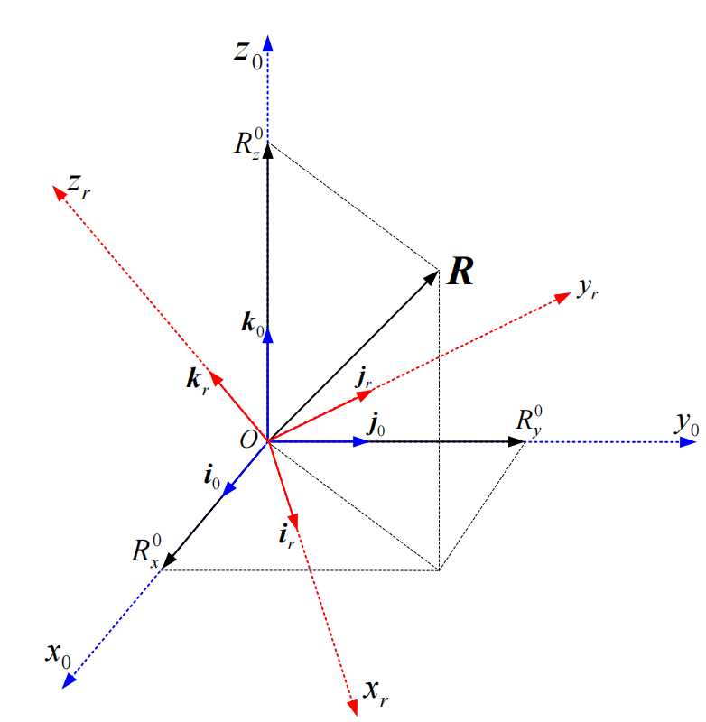
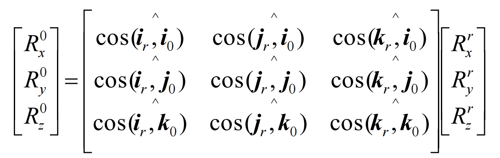
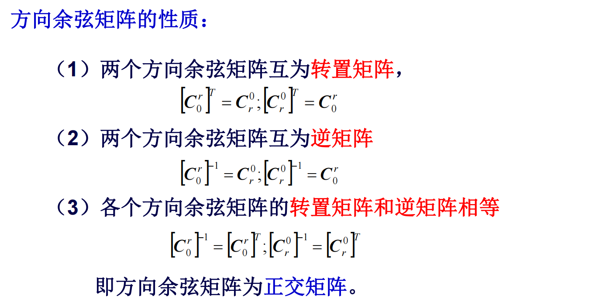

# 刚体角位置的描述方法

## 方向余弦法

这里有两个坐标系$S_0$和$S_r$，要表示他们之间的转换关系

方向余弦法实际上就是**把一个坐标系的三个单位矢量投影在另一个坐标系上**。

:::tips

下图是r系到0系的变换矩阵，是**将r系的$i$、$j$、$k$在0系中的坐标**表示出，每个都是一个3*1的列向量，**再把他们排成3列**，就是3\*3的变换矩阵了

:::

转换矩阵具有如下的性质

:::caution注意

除了方向余弦矩阵，欧拉角法写出的矩阵也**有相同的性质**，因为虽然计算方式不同，但是最后的转换矩阵**在数学上相等**。

:::

> 

## 欧拉角法

刚体坐标系相对参考坐标系的角位置，可以用三次独立的三个转角来确定，这就是欧拉法原理，这三个独立的角度称为欧拉角。

**欧拉角**的选取**有3在\*2\*2共12种**可能

> 对于定点转动的刚体，只要给定一组欧拉角，就能唯一确定刚体坐标系的九个方向余弦，从而唯一地确定刚体在空间的角位置。
>
> 所以实际上方向余弦法实际上也只有3个未知量，因为角度之间有一些约束