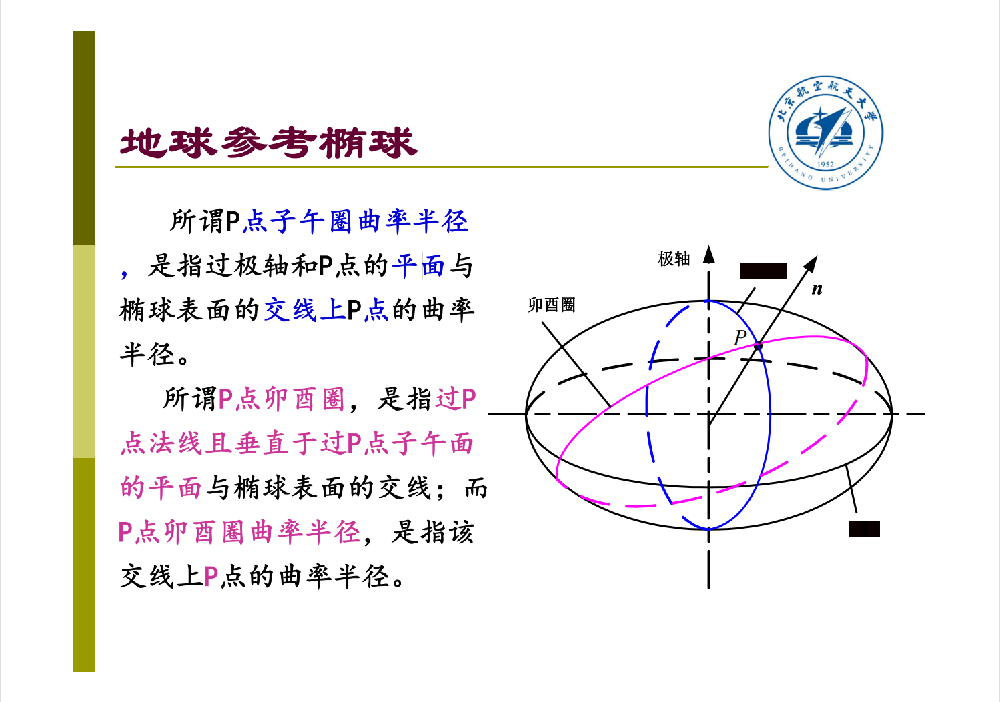

# 地球参考椭球

地垂线和导航参数的基准

## 定义

（1）从整体上看，地球近似为一个对称于极轴的扁平旋转椭球体，沿赤道方向为长轴，沿极轴方向是短轴

（2）从局部看，因为地球表面存在大陆和海洋、高山和深谷等，所以实际表面是一个不规则曲面

## 为什么是椭球

- **受到地球自转的影响**，各点需要向心加速度，同时地球上各点（除赤道外）的向心加速度方向
  并不会与该点和球心的连线方向相重合
- **引力和支持力的合力**为地球上各点**提供了**绕极轴自转的**向心加速度**。

## 离心力惯性力与离心力

- 地面是做变速运动的，即地面是非惯性参考系，这样在以地面为参考系研究物体的运动时牛顿定律就不能直接应用了

- **惯性离心力是非惯性系中的假想力，离心力是惯性系中的真实力**
- 为了使牛顿定律在非惯性系下仍然成立，那么就需要引入一个假想的惯性力，即离心惯性力

## 地球参考椭球面

$$
\frac{x^2+y^2}{R_e^2}+\frac{z^2}{R_p^2}=1
$$

### 大地水准体

如果设想把**平均海平面延伸**穿过所有陆地地块，则所形成的几何体称为大地水准体。**旋转椭球体与大地水准体基本相符。**

### 重力方向

在惯性导航中，**用旋转椭球体代替大地水准体**来描述地球的形状，并**用旋转椭球面的法线方向来代替重力方向**

## 两种纬度

### 地心纬度

地球上一点**与地心连线**和**地球赤道面**之间的夹角

### 地理纬度

**地球子午圈**上**某点的法线**与**地球赤道面**之间的夹角

## 曲率半径

即使在同一点，它的**子午圈**曲率半径也与**卯酉圈**曲率半径不同。

:::caution注意

卯酉`(mǎo yǒu)`圈是**和子午圈垂直的大圆**

:::