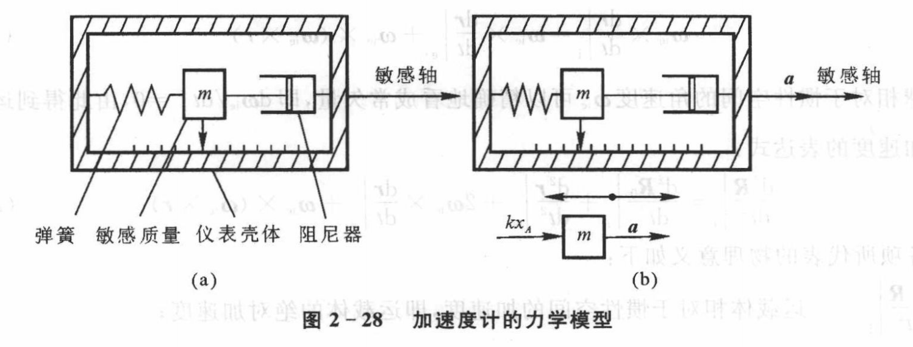

# 比力

解决**运载体相对地球运动**时**加速度计所敏感出的比力表达式**

:::caution表达式

$$
\boldsymbol{f}=\dot{\boldsymbol{v}}+\omega_{e p} \times \boldsymbol{v}+2 \omega_{i e} \times \boldsymbol{v}-\boldsymbol{g}
$$

:::

> 加速度计力学模型：
> 
> 

注意到敏感质量本身也会受到**地球、月球、太阳等天体引力**的作用，这个值会叠加到测量值上
$$
\boldsymbol{x}=\frac{m}{k}(\boldsymbol{a}-\boldsymbol{G})
$$
这个位移通过位移传感器就能转化为电信号，把加速度计的输入量$(\boldsymbol{a}-\boldsymbol{G})$称为“比力”，即：
$$
f=a-G
$$
其中引力加速度G**包括了地球、月球、太阳等天体的影响**。
$$
\boldsymbol{G}=\boldsymbol{G}_e+\boldsymbol{G}_m+\boldsymbol{G}_s+\sum_{i=1}^{n-3} \boldsymbol{G}_i
$$
:::tip

**比力**代表了**作用在单位质量上的弹簧力**。因为比力的大小**与弹簧变形量成正比**，而加速度计输出电压的大小正是与弹簧变形量成正比，所以加速度计实际感测的量并非是运载体的加速度，而是比力。

另外，**比力具有与加速度相同的量纲**

:::

在哥氏加速度一节中介绍了地球表面附近的运载体所受绝对加速度为
$$
\left.\frac{d^2 \boldsymbol{R}}{d t^2}\right|_i=\left.\frac{d^2 \boldsymbol{R}_0}{d t^2}\right|_i+\left.\frac{d^2 \boldsymbol{r}}{d t^2}\right|_e+2 \omega_{i e} \times\left.\frac{d \boldsymbol{r}}{d t}\right|_e+\boldsymbol{\omega}_{i e} \times\left(\boldsymbol{\omega}_{i e} \times \boldsymbol{r}\right)
$$
将这个绝对加速度带入比力的表达式$f=a-G$得：
$$
\boldsymbol{f}=\left.\frac{d^2 \boldsymbol{R}_0}{d t^2}\right|_i+\left.\frac{d^2 \boldsymbol{r}}{d t^2}\right|_e+2 \boldsymbol{\omega}_{i e} \times\left.\frac{d \boldsymbol{r}}{d t}\right|_e+\boldsymbol{\omega}_{i e} \times\left(\boldsymbol{\omega}_{i e} \times \boldsymbol{r}\right)-\left(\boldsymbol{G}_e+\boldsymbol{G}_m+\boldsymbol{G}_s+\sum_{i=1}^{n-3} \boldsymbol{G}_i\right)
$$
下面对上式进行简化：

- 一般来说，地球公转引起的向心加速度 $\left.\frac{d^2 \boldsymbol{R}_0}{d t^2} \right|_i$ 与太阳引力加速度 $\boldsymbol{G}_s$ 的量值大致相等，**可以约掉**
- 月球的引力加速度量值在$10^{-6}G_e$量级
- 金星和木星的引力加速度量值都在$10^{-8}G_e$量级

最终**加速度计测到的比力**为：
$$
\boldsymbol{f}=\left.\frac{d^2 \boldsymbol{r}}{d t^2}\right|_e+2 \omega_{i e} \times\left.\frac{d \boldsymbol{r}}{d t}\right|_e+\omega_{i e} \times\left(\omega_{i e} \times \boldsymbol{r}\right)-\boldsymbol{G}_e
$$
假设**安装加速度计**的**测量坐标系**为 $p$ 系，它相对地球坐标系的转动角速度为 $\omega_{e p}$ ，则有
$$
\left.\frac{d \boldsymbol{v}}{d t}\right|_e=\left.\frac{d \boldsymbol{v}}{d t}\right|_p+\boldsymbol{\omega}_{e p} \times \boldsymbol{v}
$$
由此可以得到**运载体相对地球运动时加速度计所敏感的比力**表达式：
$$
\begin{gathered}
\boldsymbol{f}=\left.\frac{d \boldsymbol{v}}{d t}\right|_e+2 \boldsymbol{\omega}_{i e} \times \boldsymbol{v}-\boldsymbol{g} \\
\boldsymbol{f}=\left.\frac{d \boldsymbol{v}}{d t}\right|_p+\boldsymbol{\omega}_{e p} \times \boldsymbol{v}+2 \boldsymbol{\omega}_{i e} \times \boldsymbol{v}-\boldsymbol{g} \\
\boldsymbol{f}=\dot{\boldsymbol{v}}+\boldsymbol{\omega}_{e p} \times \boldsymbol{v}+2 \boldsymbol{\omega}_{i e} \times \boldsymbol{v}-\boldsymbol{g}
\end{gathered}
$$

> $$
> \boldsymbol{f}=\dot{\boldsymbol{v}}+\omega_{e p} \times \boldsymbol{v}+2 \omega_{i e} \times \boldsymbol{v}-\boldsymbol{g}
> $$
>
> 式中各物理量的含义：
>
> - $\dot{\boldsymbol{v}}$：运载体相对于地球的速度在**测量坐标系**中的**变化率**
> - $\boldsymbol{\omega}_{e p} \times \boldsymbol{v}$：测量坐标系**相对地球转动**所**引起的向心加速度**
> - $2 \omega_{i e} \times \boldsymbol{v}$：运载体**相对地球速度与地球自转加速度相互影响**所形成的**哥氏加速度**
> - $\boldsymbol{g}$：**地球重力加速度**

令
$$
\boldsymbol{a}_B=\boldsymbol{\omega}_{e p} \times \boldsymbol{v}+2 \boldsymbol{\omega}_{i e} \times \boldsymbol{v}-\boldsymbol{g}
$$
则有
$$
\boldsymbol{f}-\boldsymbol{a}_B=\dot{\boldsymbol{v}}
$$
导航计算中**需要的是运载体相对地球的加速度** $\dot{v}$ ，因此必须从加速度计测得的比力中补偿**有害加速度** $a_B$ 的影响，才能得到运载体相对地球 的加速度，经过数学运算进而获得运载体相对地球的速度、位置等导航参数。

:::tip注意

此时可以知道，加速计测量出的加速度还有“向心加速度”和“哥氏加速度”组成的有害加速度的影响

:::

根据**安装加速度计的测量坐标系的不同**，可以得到**运载体相对地球运动时加速度计所敏感的不同比力表达式**，通常称为比力方程

由于**比力方程**表明了**加速度计所敏感的比力与运载体相对地球的加速度之间的关系**，所以它是惯性系统的一个**基本方程**。不论惯性系统的具体方案和结构如何，该方程都是适用的。