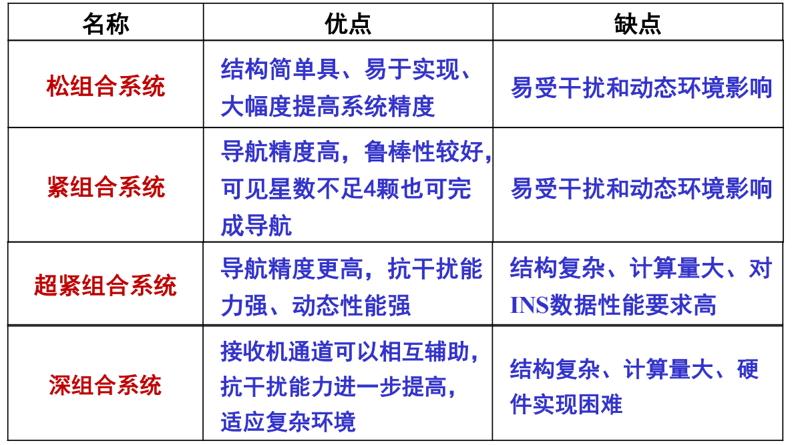

# 组合导航

现有导航都有自己的优缺点，组合导航克服了单一导航系统的局限性

## 对新型导航系统的需求：

- 长航时
- 高精度
- 高可靠性
- 低成本

## 概念

- 互补超越
- 冗余可靠
- 低成本

> 主要方法是信息融合

## 惯性、卫星组合导航

### 优势

-  综合惯性/卫星导航优点
-  改善了系统精度
-  提高了系统的可靠性

### 天文定姿

- 天文定姿根据星敏感器拍摄的星图, 计算恒星在星敏感器测量系 (s系) 下的星光矢量 $V^s$; 通过星图识别在导航星库中 检索得到恒星在地心惯性系 (i系) 下的星光矢量 $V^i$ :

### 天文定位

- 天文定位利用测者 观测的恒星天顶角 $Z$ 和 恒星的地表投影点 $P$ 的位置确定一个测者位 置圆，则测者一定在位 置圆上的某一点。

## 惯性/卫星组合导航分类及特点

### 按“组合结构、信息交换及组合程度”划分

> 松耦合、紧组合、超紧组合、深组合
>
> 

### 按“组合方式”划分

1. SINS/CNS简单组合导航模式
2. 基于陀螺仪漂移校正的SINS/CNS组合导航模式
3. SINS/CNS深组合导航模式
4. 基于全面最优校正的SINS/CNS组合导航模式