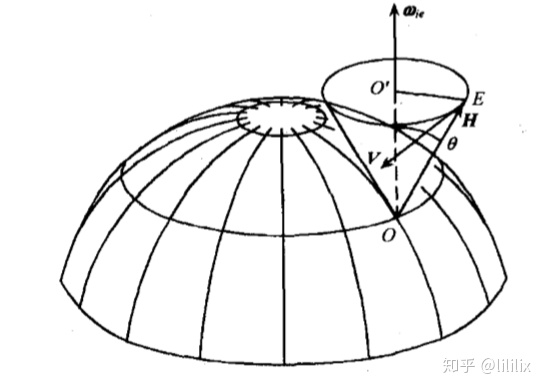

# 陀螺仪的基本特性

进动性和

## 二自由度陀螺仪的进动性

> 定义：在陀螺仪上施加**外力矩**$M$，会**引起**陀螺**动量矩矢量**$H$**相对于惯性空间转动**的特性

- 进动方向

  - 陀螺动量矩矢量 $H$ 沿最短路径握向外力矩 $M$ 的右手旋进方向, 就是进动角速度的方向。

- 角速度大小：

$$
\omega=\frac{M}{H}
$$

:::tip提示

这里的外力矩$M$是作用在**内框或外框轴**上的，不会改变动量矩的大小，根据动量矩定理，只能改变动量矩的方向

:::

- 进动产生的原因

  - 内因——转子的高速自转和动量矩的存在

  - 外因——外力矩的作用

:::caution注意

这里动量矩的变化都是相对于惯性空间而言的，利用进动性可以测量出基座的转动角速度

:::

- 表观进动
  - 因为地球地面不是惯性系，观察者以地球作为参考基准所看到的这种表面上的进动现象，叫做陀螺仪的表观进动。**每24小时进动一周**
  - 不同情况下表观进动的方向：

> 地球北极放置：
>
> 

>
> 任意纬度（自转轴指向当地**垂线**）
>
> 

>
> 任意纬度（自转轴指向当地**子午线**）
>
> 

>
> :::tip
>
> 这里的分析参考一下[转子陀螺仪的定轴性与进动性 - 知乎 (zhihu.com)](https://zhuanlan.zhihu.com/p/268591793)
>
> 如果在地球赤道坐标系下观察，可知角动量$H$的变化会受到参考坐标系角速度的影响，由[哥氏定理](./哥氏加速度)：
> $$
> \left.\frac{d \boldsymbol{H}}{d t}\right|_i=\left.\frac{d \boldsymbol{H}}{d t}\right|_e+\boldsymbol{\omega}_{i e} \times \boldsymbol{H}
> $$
> 其中， $e$ 是与地球固连的地球坐标系。
> 当不施加外力矩时，即 $\boldsymbol{M}=\mathbf{0}$ 时，
> $$
> \left.\frac{d \boldsymbol{H}}{d t}\right|_e=\boldsymbol{H} \times \omega_{i e}
> $$
> 其中， $\left.\frac{d \boldsymbol{H}}{d t}\right|_e$ 即在地球坐标系下观察到的角动量 $\boldsymbol{H}$ 变化的速度 $\boldsymbol{V}$ ，速度的方向如下图，速度的大小为 $V=H \omega_{i e} \sin \theta$ 。
>
> 
>
> 转子的矢端 $E$ 绕 $O O^{\prime}$ 轴的旋转角速度大小为 $\omega_{e G}=\frac{V}{O^{\prime} E}=\frac{H \omega_{i e} \sin \theta}{H \sin \theta}=\omega_{i e}$ ，方向与 $\omega_{i e}$ 相反。
>
> 上述结果说明，当转子陀螺的角动量与地球的自转角速度间的夹角 $\theta \neq 0$ 时，地球上观察到的转子陀螺自转轴**以 $-\omega_{i e}$ 的角速度做旋转**，旋转所形成的曲面为一圆锥面，**对称轴平行于地轴**，半锥角为 $\theta$ ，陀螺的这种运动称为**表观运动**。
>
> :::

## 二自由度陀螺仪的定轴性

> 定义：高速转动的陀螺仪，如果**不受外力矩**作用，**自转轴将相对惯性空间保持方向不变**的特性

这是转动惯量的一种体现

## 漂移角速率

由干扰力矩引起，同样满足动量矩定理
$$
\omega_d=\frac{M_d}{H}
$$
其中$M_d$是干扰力矩

:::tip干扰力矩的主要来源

- 轴承间的摩擦
- 陀螺仪重心与框架中心不重合
- 陀螺马达的动不平衡

:::

## 单自由度陀螺仪的特性

上图是一个单自由度陀螺

可以看到其中的转子少了Z方向的自由度

- 当且仅当基座绕缺少自由度的方向（$Z$）转动时，将通过框架轴个框架施加一个力矩，使得陀螺仪绕框架轴（$X$）进动

:::tip

这表明，单自由度陀螺仪具有敏感绕**其缺少自由度轴线的角运动**的特性。

:::
