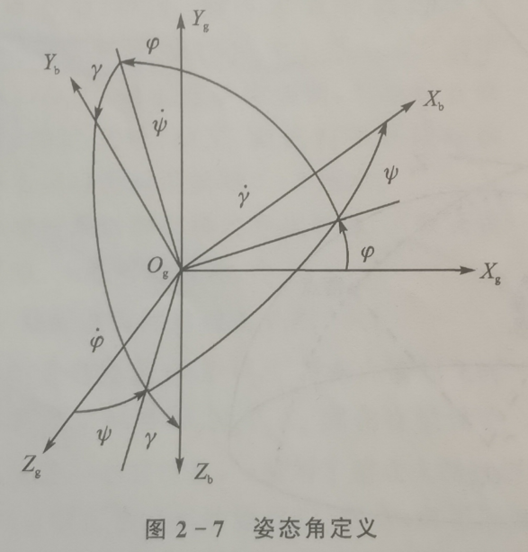
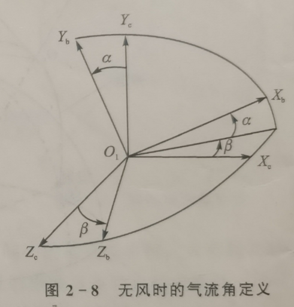
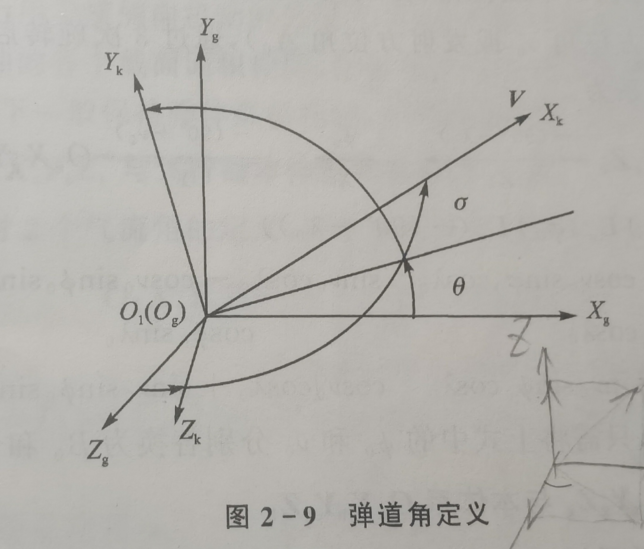

# 飞行器姿态的表示

讨论3组重要的角度

## 四个主要坐标系

具体定义参见[常用坐标系](./常用坐标系)

- 发射点坐标系$S_g$
- 本体系$S_b$
- 速度坐标系$S_c$
- 弹道坐标系$S_k$

## 三组规定好的角

- 姿态角——俯仰角$\phi$、偏航角$\psi$、滚转角$\gamma$
- 气流角——攻角$\alpha$、侧滑角$\beta$
- 弹道角——弹道倾角/速度倾角$\theta$、弹道偏角/航向角$\sigma$

### 姿态角定义

| 名称           | 定义                                                         | 备注                                                         |
| -------------- | ------------------------------------------------------------ | ------------------------------------------------------------ |
| 俯仰角$\phi$   | $O_1X_b$轴在$X_gO_gY_g$平面的投影，与$O_gX_g$之间的夹角，**抬头为正** | $O_1X_b$轴指向飞行器前方 $X_gO_gY_g$平面是**发射时**飞行器“垂直方向”的平面（因为$S_g$系Y轴“向上”） $O_gX_g$轴指向**发射方向**在发射点水平面的投影 相当于“飞行器前方”相对于“发射时的前方”抬头的角度 |
| 偏航角$\psi$   | $O_1X_b$轴与$X_gO_gY_g$平面的夹角，**向右为正**              | $O_1X_b$轴指向飞行器前方 $X_gO_gY_g$平面是**发射时**飞行器“垂直方向”的平面（因为$S_g$系Y轴“向上”） 相当于“飞行器前方”相对于“发射时的竖直面”右转的角度 |
| 滚转角$\gamma$ | $O_1Z_b$轴与$O_1X_b$和$O_1Z_g$两轴构成平面之间的夹角，**右滚动为正** | $O_1X_b$轴指向飞行器前方 $O_1Z_g$轴指向“发射时”飞行器右方 上述两轴组成“没有滚转，只改变俯仰”的平面 $O_1Z_b$轴指向飞行器右方 相当于“飞行器当前右机翼”与上述平面的夹角，即为滚转的角度 |

### 姿态角图示

## 无风时气流角定义

| 名称          | 定义                                                         | 备注                                                         |
| ------------- | ------------------------------------------------------------ | ------------------------------------------------------------ |
| 攻角$\alpha$  | $O_1X_c$轴在$X_bO_1Y_b$平面的投影，与$O_1X_b$之间的夹角，**向下为正** | $O_1X_c$轴指向速度方向 $X_bO_1Y_b$是飞行器的“纵向”平面 $O_1X_b$轴指向飞行器前方 相当于“飞行器速度前方”相对于“飞行器物理上的前方”下压的角度 |
| 侧滑角$\beta$ | $O_1X_c$轴与$X_bO_1Y_b$平面的夹角，**向右为正**              | $O_1X_b$轴指向飞行器前方 $X_gO_gY_g$平面是“垂直方向”的平面（因为$S_g$系Y轴“向上”） 相当于“飞行器速度前方”相对于“飞行器当前竖直面”右转的角度 |

:::tip提示

可以发现攻角和俯仰角、侧滑角和偏航角有相当多的相似之处

有点“攻角是速度的俯仰角，侧滑角是速度的偏航角”的意思，但是注意有两点不同：

- 攻角（侧滑角）是相对于**当前**飞行器姿态，而俯仰角（偏航角）是相对于**发射时**的姿态
- **俯仰角**的定义是**向上为正**，而**攻角**是**向下为正**

:::

### 无风时气流角图示

:::warning注意

这是无风是气流角的定义，如果是**有风情况**，攻角和侧滑角都需要**加上**一个附加项

- 附加攻角$\alpha_w$
- 附加侧滑角$\beta_w$

他们分别定义为飞行器速度为0时，气流相对于本体系的攻角于侧滑角

:::

## 弹道角定义

| 名称             | 定义                                                         | 备注 |
| ---------------- | ------------------------------------------------------------ | ---- |
| 速度倾角$\theta$ | 速度矢量在$X_gO_gY_g$平面内的投影与$O_gX_g$轴的夹角，向上为正 |      |
| 航向角$\sigma$   | 速度矢量在$X_gO_gY_g$平面之间的夹角，向左为正                |      |

:::tip提示

速度倾角和俯仰角、航向角和偏航角也有异曲同工之妙

类似“速度倾角是速度**相对发射点坐标系**的俯仰角，侧滑角是速度**相对发射点坐标系**的偏航角”，注意：

- 速度倾角（航向角）是**速度前方**相对发射点坐标系，俯仰角（偏航角）是**飞行器前方**相对于发射点坐标系
- **偏航角**的定义是**向右为正**，而**航向角**是**向左为正**

:::

### 弹道角图示

## 总结

3组角度，其实就是**“飞行器前方、速度前方”**相对**“本体坐标系、发射点坐标系”**的角度

- 飞行器前方——本体坐标系（飞行器前方就是$O_1X_b$轴，所以没有角度）
- 飞行器前方——发射点坐标系（俯仰角$\phi$、偏航角$\psi$、滚转角$\gamma$）
- 速度前方——本体坐标系（攻角$\alpha$、侧滑角$\beta$）
- 速度前方——发射点坐标系（弹道倾角/速度倾角$\theta$、弹道偏角/航向角$\sigma$）

## 怎样记忆字母？

- 俯仰——fu yang——首字母F——$\phi$读作`/faɪ/`
- 偏航——pian hang——首字母P——$\psi$读作`/psaɪ/`
- 滚转是剩下的那一个
- 攻角和侧滑角直接记住
- $\sigma$不对称所以是弹道偏角，另一个对称的$\theta$就是弹道倾角