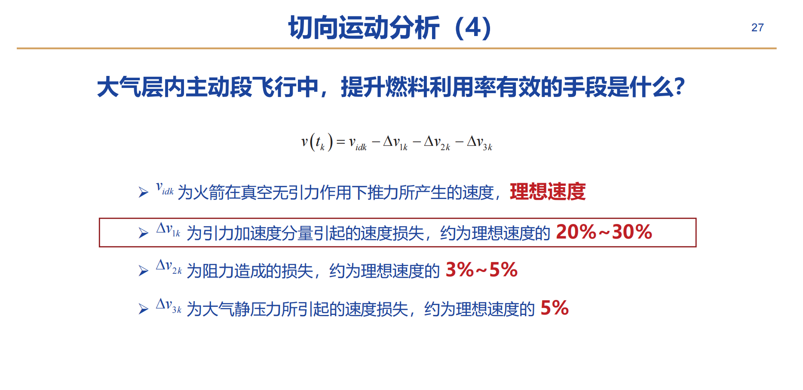
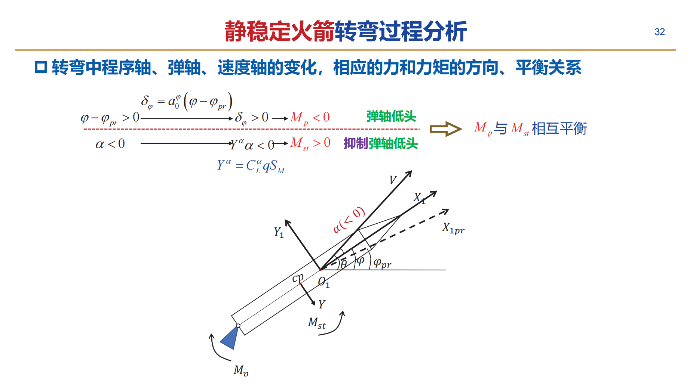
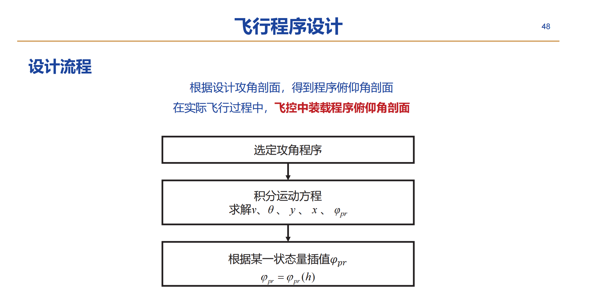

# 开环制导

关键是设计合理的飞行程序

## 运动方程简化假设

（1）引力假设

- 视地球是匀质球体，**忽略扁率和引力分量的影响**

（2）地球自转假设

- 忽略地球自转，即**忽略哥氏加速度和牵连加速度**

（3）小角度假设

- **视欧拉角和控制量均为小量**，正弦取角度，余弦取1，乘积作为二阶小量略去

（4）力矩平衡假设

- 火箭的姿态是稳定的，绕质心运动是短周期运动，对质心运动的影响可以忽略，**忽略运动方程中与姿态角速度和角加速度有关的项**

## 火箭运动特性分析

纵向运动可以分为**切向运动和法向运动**

### 切向运动

如何提高理想速度：

- 减小结构质量与总质量的比值
- 提高喷气速度

### 法向运动

**大气层内**飞行程序的三个阶段

- 垂直上升段
- 转弯段
- 瞄准段

火箭在**重力、气动力、推力**相互作用下完成转弯

### 静稳定性

重心在压心之前，纵向静稳定，离压心越近，纵向静稳定度越低，重心位于压心之后，纵向静不稳定
$$
\begin{cases}x_g-x_p<0 & \text { 静稳定火箭 } \\ x_g-x_p \geq 0 & \text { 静不稳定火箭 }\end{cases}
$$
注意这个x的原点在**火箭的头部**

程序角要求发动机产生一个低头力矩，而负攻角会产生一个抬头力矩，使得攻角变小，直到回到平衡状态

## 飞行程序设计

### 基本原则

- 垂直起飞
- 限制火箭转弯时的法向过载（重力转弯）
- 程序俯仰角变化连续，角速度和角加速度有限制
- 保证可靠的分离条件和合适的再入条件

### 垂直上升段

结束时间要适中

- 过早结束——姿控能力不足
- 过晚结束——转弯所需过载升高

### 转弯段设计

- 前半段进行有攻角的转弯，在气动力急剧变化的跨音速前结束，减少气动载荷和气动干扰，在马赫数在0.7-0.9时使攻角减少为0
- 后半段为高动压区，只依靠重力的法向分量进行转弯（重力转弯）

### 瞄准段设计

保持不变的程序角，对于中近程导弹，一般要求**主动段终点的速度倾角取最小能力弹道的倾角**

### 总结

