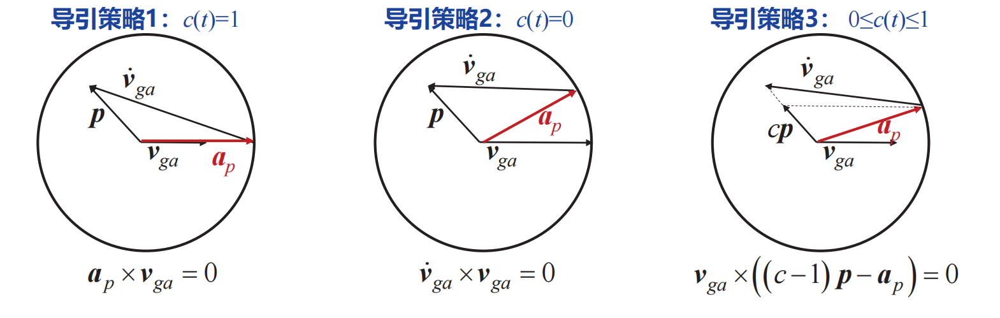

# 闭环制导

主要是主动段后半程，大气层外的制导律

## 基础知识

### 闭环制导与摄动制导区别

- 摄动制导——对姿态角、发动机关机时间进行**离线设计**
- 闭环制导——在简化条件下，得到运动方程的**显式解（解析或数值）**基于制导误差进行**全量反馈调节**

### 大气层内外制导不同

- 大气层内——气动力影响显著，重力场影响小
- 大气层外——气动力影响小，重力场影响显著

:::tip说明

接下来我们讨论的都是**主动端后半程，大气层外的制导**，需要的一个最重要的运动方程是
$$
\frac{\mathrm{d} \boldsymbol{v}}{\mathrm{d} t}=\frac{\boldsymbol{F}_p}{m}+\boldsymbol{g}
$$
该方程可以写为如下的形式：

:::

### 需要速度与待增速度

在当前位置矢量$r(t)$处，如果以需要速度$v_R(t)$关机，可以完成制导任务

:::caution注意

在本课程中，**需要速度是当前位置矢量与当前时间的函数**

这是因为只要我们确定了物体的位置，那么显然他关机后会自由滑行，其运动方程会非常简单，很容易反向确认出初速度（也就是此时的需要速度），不过我们知道从一点抛到另一点的轨迹有无数条，所以一般会加一些约束条件

:::

待增速度就是需要速度与当前速度之差

## 导引方法

### 导引目标

下面两个目标实际上是等效的

- **将当前速度导引至需要速度**
- **将待增速度导引至0**

之后的讨论中我们使用第二种定义

## 三种导引策略

这里我们假设待增速度$v_{ga}$是已知的，来确定发动机推力$F_p$的大小和方向

**导引策略1（他甚至不配拥有名字）**

加速度方向与待增速度方向相同

$$
a\times v_{ga}=0
$$

当推力远大于引力时，也可以写为

$$
a_p\times v_{ga}=0
$$

**导引策略2——叉积导引**

待增速度导数负方向与待增速度方向相同
$$
\dot v_{ga}\times v_{ga}=0
$$
这里涉及到的**待增速度变化率**，他可以写成**需要速度的变化率减去当前速度的变化率**
$$
\dot{\boldsymbol{v}}_{g a}=\dot{\boldsymbol{v}}_R-\dot{\boldsymbol{v}}=\dot{\boldsymbol{v}}_R-\boldsymbol{g}-\boldsymbol{a}_p
$$
令
$$
\boldsymbol{p}=\dot{\boldsymbol{v}}_R-\boldsymbol{g}
$$
则
$$
\left(\boldsymbol{p}-\boldsymbol{a}_p\right) \times \boldsymbol{v}_{g a}=0
$$
:::tip注意

那么新问题出现了，**怎样求需要速度的变化率？**

:::

**导引策略3——结合1、2的方式**

**3种导引策略对比**

## 需要速度的计算

在上面的两种制导方式中，我们发现都需要知道**需要速度及其导数**，总体上有两种方法确定

### Lambert制导

关于兰伯特问题的说明参见这里：[兰伯特问题 - 卫星百科](https://sat.huijiwiki.com/wiki/兰伯特问题)

标准的兰伯特问题被描述为：给定初末位置和转移时间，求初末速度。这正好符合我们的条件，因为我们在设计轨道时，限定了再入点，而需要速度的定义就是当前时刻关机，那么当前位置就是关机点，然后再给定一个目标时间就可以利用Lambert制导求出飞行器当前需要速度了。

:::tip说明

在上面那个链接里说，Lambert问题是没有解析解的，但是在老师的PPT里却说可以求出Lambert问题的闭环解析解，最终的形式是把速度大小、速度倾角、需要时间表示成了相应的函数，这里并没有指定目标时间，也许这就是能得到解析解的原因？

现在最大的疑惑就是怎么实时而又快速的计算Lambert方程，得到现在的需用速度，按理来说，目标时间$t_F$应该也是输入变量才对，

:::

### Q制导

Q制导里首先就假定了需要速度就只是**当前位置和时间**的函数，然后就可以写成$\boldsymbol{v}_R(\boldsymbol{r}(t), t)$的形式

注意到其中矢径也是时间t的函数，所以对t求导时是**复合函数求导**，同时需要求偏导：
$$
\frac{\mathrm{d} \boldsymbol{v}_R}{\mathrm{~d} t}=\frac{\partial \boldsymbol{v}_R}{\partial t}+\frac{\partial \boldsymbol{v}_R}{\partial \boldsymbol{r}} \frac{\mathrm{d} \boldsymbol{r}}{\mathrm{d} t}
$$
上面的式子又可以化成
$$
上式=\frac{\partial \boldsymbol{v}_R}{\partial t}+\frac{\partial \boldsymbol{v}_R}{\partial \boldsymbol{r}} \boldsymbol{v}=\frac{\partial \boldsymbol{v}_R}{\partial t}+\frac{\partial \boldsymbol{v}_R}{\partial \boldsymbol{r}}\left(\boldsymbol{v}_R-\boldsymbol{v}_{g a}\right)=\boldsymbol{g}-\frac{\partial \boldsymbol{v}_R}{\partial \boldsymbol{r}} \boldsymbol{v}_{g a}
$$
这一块还比较绕，**位矢的时间导数首先换成当前速度，然后再换成需用速度减待增速度**，最后一步中：
$$
\frac{\partial \boldsymbol{v}_R}{\partial t}+\frac{\partial \boldsymbol{v}_R}{\partial \boldsymbol{r}} \boldsymbol{v}_R=\boldsymbol{g}
$$
这是因为当前速度等于需要速度时，发动机关机，待增速度为0，飞行器就仅受重力作用，**速度变化率就等于重力加速度**：
$$
\frac{\mathrm{d} \boldsymbol{v}}{\mathrm{d} t}=\frac{\partial \boldsymbol{v}_R}{\partial \boldsymbol{r}} \boldsymbol{v}_R+\frac{\partial \boldsymbol{v}_R}{\partial t}=\boldsymbol{g}
$$
前面已经说了待增速度导数与需要速度导数之间的关系，他等于**需要速度的变化率减去当前速度的变化率**
$$
\dot{\boldsymbol{v}}_{g a}=\dot{\boldsymbol{v}}_R-\dot{\boldsymbol{v}}=\dot{\boldsymbol{v}}_R-\boldsymbol{g}-\boldsymbol{a}_p
$$
把需要速度的变化率带入其中得
$$
\frac{\mathrm{d} \boldsymbol{v}_{g a}}{\mathrm{~d} t}=\frac{\mathrm{d} \boldsymbol{v}_R}{\mathrm{~d} t}-\boldsymbol{g}-\boldsymbol{a}_p=\boldsymbol{g}-\frac{\partial \boldsymbol{v}_R}{\partial \boldsymbol{r}} \boldsymbol{v}_{g a}-\boldsymbol{g}-\boldsymbol{a}_p=-\frac{\partial \boldsymbol{v}_R}{\partial \boldsymbol{r}} \boldsymbol{v}_{g a}-\boldsymbol{a}_p
$$
定义Q矩阵为**需要速度对位矢的偏导**
$$
\boldsymbol{Q}=\frac{\partial \boldsymbol{v}_R}{\partial \boldsymbol{r}}
$$
则待增速度的导数为：
> $$
> \frac{\mathrm{d} \boldsymbol{v}_{g a}}{\mathrm{~d} t}=-\boldsymbol{Q} \boldsymbol{v}_{g a}-\boldsymbol{a}_p
> $$

:::tip巧记

这里写成了状态空间的形式，类似与$\dot x=Ax+bu$，这里$x$就是待增速度，$A$就是$-Q$，b就是-1，u是$a_p$

:::

其框架图为

### Q制导补充说明

- Q矩阵是**可离线计算**的**时变矩阵**
- 通过Q矩阵计算，隐式的**依赖重力场**
- $a_p$是发动机推力加速度，**加速度计直接测量**【注意这一个，制导并不控制$a_p$大小，只对方向控制】
- 对上式积分，可以得到$v_{ga}$
- 时变矩阵Q的存储和运算是困难的，因此其应用场景主要为：**当主动段地心转角比较小时，可将Q矩阵视为常值矩阵**
- 在任意时间t，为了最小化发动机剩余燃烧时间，应当最大化$a_p·v_{ga}$，即采取第一种导引策略
