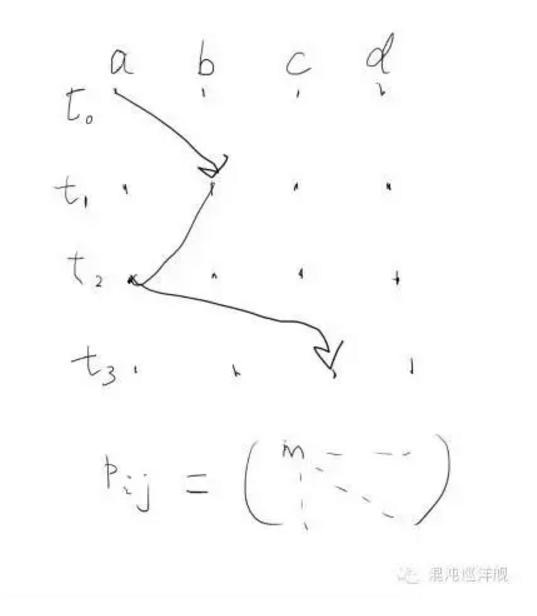
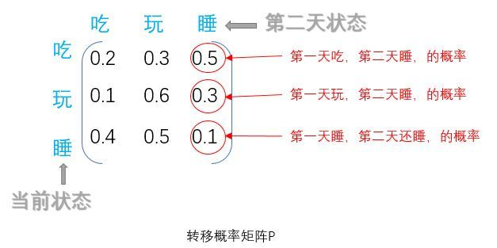
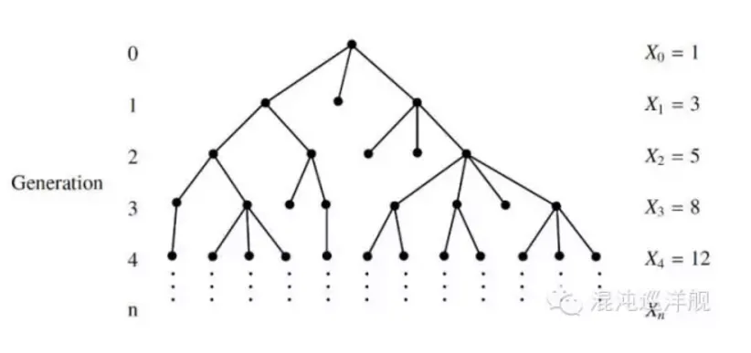
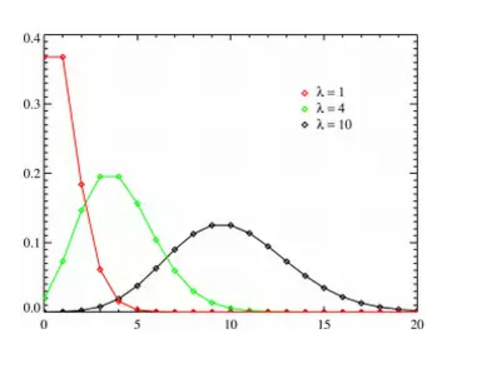
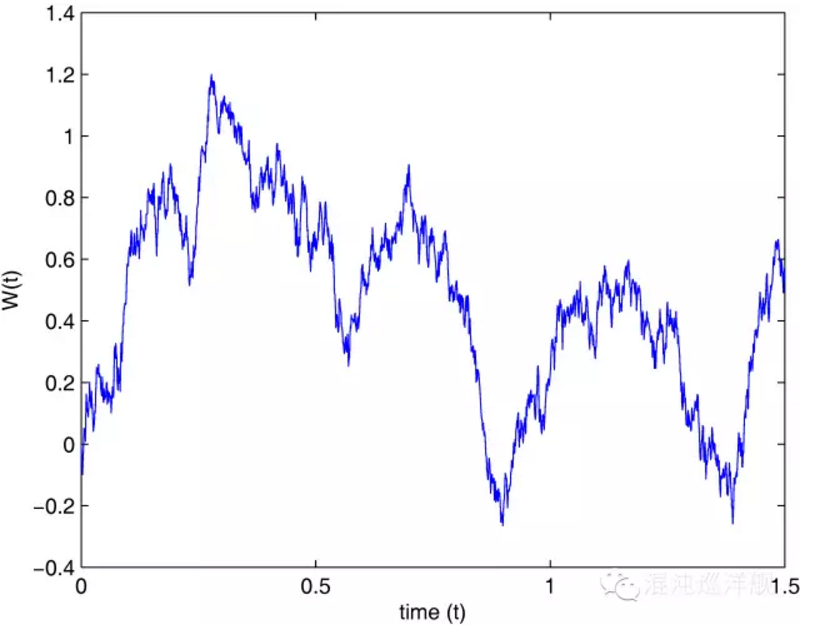

# 马尔科夫链(Markov)

简要介绍马尔科夫链

> 来源：以下内容节选自知乎
> 作者：许铁-巡洋舰科技
> 链接：https://www.zhihu.com/question/26694486/answer/349872296

## 经典表述

$$
Pr(X_{n+1}=x|X_1=x_1,X_2=x_2,…,X_n=x_n)=Pr(X_{n+1}=x|X_n=x_n)
$$

[马尔科夫链](https://www.zhihu.com/search?q=马尔科夫链&search_source=Entity&hybrid_search_source=Entity&hybrid_search_extra={"sourceType"%3A"answer"%2C"sourceId"%3A349872296})的核心条件概率表达式就是这台火车链接不同车厢的链条。 如果这个条件概率关系不随时间变化，我们就得到经典的稳态马尔科夫链。它有一个良好的性质，就是当这个过程启动一段时间就会进入统计稳态，稳态的分布函数与历史路径无关。

## 一个简单的例子

关于生育偏好是否影响男女比例的问题。

我们知道过去的人喜欢生男孩，往往生女孩子就不停生，直到生到一个男生为止，因此就造成很多一大堆姐姐只有一个弟弟的家庭。我接触过的一些特别聪明的人都会认为这样的行为会影响男女比例。大部分人觉得会造成女孩比例多，少数人认为会增加男孩比例。 实际呢？  

**一言以蔽之： 不变。**     为什么？  生育问题是典型的稳态马尔科夫过程，下一次生育不受上一次生育的影响。 根据马氏过程的特性，你知道历史无需考虑历史路径， 最终的平衡概率只取决于每一步的概率。所以无论你怎么玩，不论是你拼命想生男孩还是女孩，都无法影响人口比例。  

但是有一招却是有影响的，就是打胎。 为什么？ 答案依然很简单，你改变了每一步的概率。  

这就是马尔科夫过程的威力和魅力，可惜人生却不是马尔科夫过程， 因为每一步都高度依赖于过去n步，因此人生是高度历史路径依赖的。

## 稳态Markov过程

如果说markov过程每一步与前一步的关系是与时间无关的，即当前其中的概率关系是不变的，则这个过程就是稳态的。
$$
Pr(X_{n+1}=x|X_n=y)=Pr(X_{n}=x|X_n-1=y)
$$
在这个极度简化的模型下，**markov process** 可归结为一个**在态空间里的跃迁轨迹**。下图的随机变量是横轴（a，b，c，d四个态），时间是纵轴。系统从此刻的态跃迁到下一刻的态都是随机的，而且跃迁的概率由一个数字决定，这个数字不由轨迹的历史决定，因而markov。从此刻任一状态到达下一刻任意状态包含4x4个概率，因此可以写作一个4x4的[跃迁矩阵](https://www.zhihu.com/search?q=跃迁矩阵&search_source=Entity&hybrid_search_source=Entity&hybrid_search_extra={"sourceType"%3A"answer"%2C"sourceId"%3A349872296})。跃迁矩阵Pij涵盖了过程的全部信息。

:::info

相当于穷举出了所以可能的转移概率，下面还有张更通俗的图

:::

## 稳态过程的特征量

**稳态过程含有两个个重要的特征量： 平均值和[自相关函数](https://www.zhihu.com/search?q=自相关函数&search_source=Entity&hybrid_search_source=Entity&hybrid_search_extra={"sourceType"%3A"answer"%2C"sourceId"%3A349872296})（Auto-correlation）**，稳态（stationary）的含义正是在平均值附近扰动，在这个情况下随机性换以另外一个名词-fluctuation（扰动）。 而在非稳态下，扰动和平均值的概念变得模糊，失去意义。

平均值自然重要，但扰动却往往包含着平均值所没有的信息。 首先我们计算方差，来看扰动的剧烈程度，但是这远远不够。

Auro-correlation和之前描述的相关性具有内在的联系，事实上它描述的就是此时的扰动和彼时的扰动的相关性。
$$
R(\tau)=\frac{E[(X_t-\mu)(X_{t+\tau}-\mu)]}{\sigma^2}
$$
这个量可以理解为你手里有一个信号，首先你减去平均值，这样信号就在0附近扰动。 你把这个信号平行移动一个时间差， 然后把它和原来的信号乘起来，如果说信号本身代表的过程在时间上胡乱跳跃无迹可寻， 那么这个量就很接近0，因为正和负的部分无序的乘起来，正负互相抵消，你的期望就是0。反之，如果你的信号内包含内在的构造（pattern），就会得到不为0的值。

:::note

这个感觉有点像正交性

:::

**因此，日常生活中你手里具有的往往是数据，你什么都不知道的时候，计算这个量就是起点，这个东西在帮你寻找无序中的结构（pattern），它将告诉我们系统噪音的性质。**

比如我们经常说的白色噪声（white noise）的定义就是自关联性为0， 因为它要的是绝对的无序， 毫无记忆，毫无结构。这种信号就是最基本的噪声形态。

而如果我们发现一个随时间差变化很慢的自相关函数，往往显示系统具有记忆的特性，因而产生了更复杂的结构， 或者系统临近相变。

自相关性的计算告诉我们的是， 你不要只看表面的无序有序，因为人眼喜欢在无序中寻找有序，而一个有力的计算就可以告诉你比你的眼睛更准确的信息。

## master equation

刚才描述离散的markov过程，**如果一个过程是连续的，不再分为第一步第二步第三步， 我们就可以用微分方程描述一个马尔科夫过程。 这就是master equation - 所谓大师方程**。 这是物理，化学，经济学，得到一些给力结果经常用到的微分方程。

master equation直接关注的是随机过程的全貌。刚才所说的跃迁轨迹是一次实验的结果，而Master Equation 描述的却是无数实验者同时入场，进行马尔科夫过程，你会看到一个新的图像。系统每一个时刻的状态不再是态空间一个具体的点，而是一大团点（一大丛实验者），它们慢慢的在态空间里运动，我们可以统计站在不同的状态上的实验者个数，因而得到的是一个概率分布，正是之前说的分布函数的概念。 物理经常用概率云，概率波一类的词描述这种情境。 其实都是在说我们不再用一个数字描述世界，比如速度，位置，而是这个值的分布函数。变化的不再是某个特定的值而是它的分布函数。

状态空间的分布函数，又可称作场。由此，场的物理学可以徐徐入场。 

之前说的马尔科夫过程的关键-联系此刻与下一刻的条件概率，在这里以跃迁矩阵A表示。

刚才讲到牛顿力学和马尔科夫过程有着内在的联系，**Master equation就是随机过程里的牛顿第二定律。**这个方程对于解释很多物理化学里的随机过程有神一般的效力。他就是**概率场的动力学方程。**
$$
\frac{d\vec{P}}{dt}=A(t)\vec{P}
$$
A就是跃迁矩阵，而向量P即概率场，就是经过时间t，系统状态的分布函数。该方程指示了概率会如何随时间变化。

由此我们看到用Master方程研究问题的好处，转不确定为确定。当你站在纵览所有可能性的制高点，把所有可能性看做高维空间的“概率场”。 不确定性的随机游走变成了概率分布函数（概率场）的确定性演化。这也是为什么场物理在近代物理后成为主导，所研究对象多为随机过程。

> 量子力学大名鼎鼎的[薛定谔方程](https://www.zhihu.com/search?q=薛定谔方程&search_source=Entity&hybrid_search_source=Entity&hybrid_search_extra={"sourceType"%3A"answer"%2C"sourceId"%3A349872296})，其实说的也是这回事，我们无法同时确定电子的位置和动量，因为我们转而求其[概率分布函数](https://www.zhihu.com/search?q=概率分布函数&search_source=Entity&hybrid_search_source=Entity&hybrid_search_extra={"sourceType"%3A"answer"%2C"sourceId"%3A349872296})， 得到一个类似Master equation的微分方程，只不过数学形式更复杂，但思维都是转而研究概率的动力学。 这个方程却干掉了一个物理史上的超级难题， 如果在考虑微观世界的不可确定下预测它们的运动。

:::caution 注意

稳态解：master equation 指导系统演化，如果A（t）不含时间， 就得到刚才说的稳态过程，系统会演化成一个稳定状态，即分布函数不再随时间变化。A*P=0 我们通常称为平衡态

:::

## 一些经典的Markov例子

### 分叉过程 Branching Process

分叉过程 ，一个祖先繁衍的后代， 会出现多少个家庭， 每个家庭人口是怎么分布的？

所有家族的演化，生物种群的繁殖，都可以用这个模型研究。一个个体可以繁殖出的子嗣数量是一个随机变量，经过n代之后将形成一个由大小迥异的家族组成的群体。

如果对应为一个随机过程：-每一代的人口数就是就是随机变量，我们要研究的就是与这个随机变量对应的分布函数。

这个过程具有的典型性质是迭代： 如果上一代的人口数Gn，下一代就是Gn+1=G（Gn），给定第n代的家族人口分布，那么下一代的家族人口分布只与上代有关。所以这个是典型的Markov process

这个问题可以推出一些有趣的问题， 比如人口中各大姓氏的比例。 一般情况下，各大姓氏的比例在各个种群中符合相同的统计规律（幂律），就是Branching Process 的结果。

### 泊松过程 Poission Process

比如一个小旅店里一晚上到来的客人数量随时间的变化，或者光子枪喷出的光子数, 一个帖子两分钟内的访问次数，都是再经典不过的例子了。

泊松分布由二项分布演化而来。二项分布十分好理解，给你n次机会抛硬币，硬币正面向上概率为p，那么n此抛出有k次朝上的概率有多少？ 这是一个经典的二项分布。当这里的概率p趋于0，而n趋于无穷，我们就得到一个[泊松分布](https://www.zhihu.com/search?q=泊松分布&search_source=Entity&hybrid_search_source=Entity&hybrid_search_extra={"sourceType"%3A"answer"%2C"sourceId"%3A349872296})。泊松分布多用于连续时间上的问题， 如果概率在连续的时间上是均匀不变的（任意时候发生的概率为P），我们就有一个泊松过程。这也极好理解，只要你把时间切割成小段。 比如打开一个帖子的两分钟访问者的概率分布问题，你把两分钟分成120秒， 每秒上有访问者进入的概率是确定的，那么这无非就是投120次硬币多少次向上的问题， 由于微小时间尺度上一件事情发生的概率通常很小，因此，泊松分布通常成立。
$$
P(X=x)=\frac{\lambda^x-e^{-\lambda}}{x!}
$$
泊松分布一般的形状，三条曲线代表了平均值不同的三个泊松分布：

泊松过程，恐怕是最简单的随机过程，也是所有随机过程的参考系-好比物理的惯性定律。我们研究一个随机过程时候，第一个做的就是与泊松做比较。

为什么泊松是一切随机过程的参考系？因为泊松是一个此时的变化和彼时毫无联系的过程，或者说此刻和下一刻是完全独立的，markov说的是与此时只允许与上一个时刻有联系，而泊松就更近一步，把这种联系也取消掉。

如果我们假定每件事件的发生都与其它时刻事件的发生无关，我们就可以试图用泊松分布表述它。比如一个商店前台顾客的光临，一般情况下，每一个顾客的到来都与前一个顾客无关，因此一段时间内前台顾客的数量符合泊松分布。

反过来，判断一个随机过程的前后事件是否独立，也可以通过它是否符合泊松分布判别，如果你得到的统计分析偏离了泊松，通过是前后事件相关联的标志。 事实上生活中的事情都偏离泊松，而是具有强大的关联性。 比如你一周内收到的邮件，通过在周一早上爆发而来，而在周末减少到零。你在一段时间会不停叫桃花运，而后一段十分冷清等。 这些都告诉你要找找背后的原因。

### 维纳过程 Wiener Process

Wiener Process， 其原型就是大名鼎鼎的布朗运动。这恐怕是在自然科学以及经济金融里用的最广泛的随机过程。也是随机过程的灵魂基础。

关于Wiener Process， 最有趣的比喻是随机游走的醉汉。醉汉在一条直线上移动，往左或往右的概率相等。醉汉走出去的距离与时间的关系，就是Winner Process。

上上下下的随机游走表现的美丽轨迹，也是众多股市爱好者经常看到的形状。

Wiener Process 所依赖的假设特别简单： 醉汉走出的每一步的距离和上一步无关（依然在说马氏性），而这一步走出的长度是由一个确定的高斯分布产生的随机数。 如果这个高斯分布的期望为0，那么这个过程就是一个纯粹的随机游走，反之则是一个但有漂移（drift）的随机游走。

股票和期货等的价格规律，最基本的假设就是随机游走，在此之上可以得到一些简单的定价模型。 但是事实上， 这种规律只在短期内成立，一旦金融危机爆发， 模型就终止了。 而金融危机，依然是过程内部的长程关联的表现。 因为市场的交易毕竟不是随机的，股市的涨落引起人们心情和预期的变化，从而以正反馈的形式给股市，所谓涨则疯买，低则疯卖，这种关联性打破了随机游走的梦。

## 如何获取信息

**说了这么半天随机过程，起核心的应用却还没有谈，如何在一个随机性的变化过程中，提取信息?**

首先，变化过程从来都是一些数据记录的，dirty data， 肮脏混乱的数据， 你要把这些data输入到一个电脑程序中，用我说的前面那套东西搞它。随机过程的重要性就在这个数据里提取信息的过程。

怎么搞，分两步，正问题和反问题：

**反问题-数据出发：**

**1. 数据可视化。**因为数据杂乱无章，你几乎看不到任何信息，你要做的第一个工作就是让杂乱的数据平均化，平均，才容易观察趋势。那么何为平均化？-低通滤镜，去掉不必要的高频信息。 这里的关键是时间窗口，时间窗口就是你用来作平局的数据尺度，时间窗口内的数据你都用其平均数代替。 时间窗口的选择学问很大，一般越大容易看整体变化的趋势，越小则可以精细统计细节信息。 而最好的做法是在平均时候变化时间窗口，观察数据链是如何随时间窗口大小变化的。

**2. 计算分布函数。**选择恰当的变量计算分布函数。随机过程的关键信息就在分布函数里。每一种特定的随机过程，都有特定分布函数对应。因此，从分布函数识别随机过程，就是反向判断的关键。

**3. 寻找相关性：** 信息就是那些多次重复中随机过程中不变的数据信息。所以提取信息首先要足够数据。然后计算不同次试验数据之间的相关性，相关性大小是数据信息含量的直接指示。

**4. 统计学习：** 基于贝叶斯分析的统计学习将在后续篇章叙述。他是目前从数据里提取信息的大势所趋（state of art）。

**正问题-模型出发：**

要判断由数据推测出来的随机过程对不对，就反过来进行[模型模拟](https://www.zhihu.com/search?q=模型模拟&search_source=Entity&hybrid_search_source=Entity&hybrid_search_extra={"sourceType"%3A"answer"%2C"sourceId"%3A349872296})， 模型将产生与试验类似的数据，这个时候我们就可以看我们猜测的模型正确了多少。 比如刚才说的泊松过程就是最简单的模型。 往往我们可以先假定一个过程是泊松过程，然后就可以推得一组分布函数，把推得的分布函数和实际从数据中观测的分布函数比较，我们就可以知道我们和这个最简单的模型的偏差。 模型也是一个循序渐进不断修正的过程， 这点依然和时下流行的统计学习有关。
