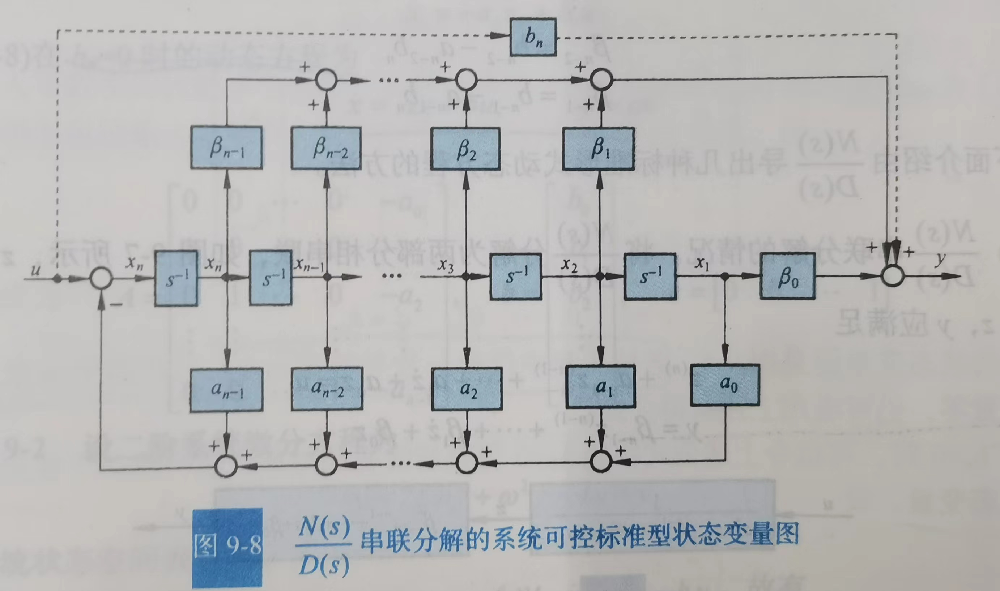

# 线性系统的状态空间描述

介绍状态空间的常用概念，介绍状态空间表达式建立方法，推导可观和可测标准型

## 1. 两种数学描述

系统的数学描述反映系统变量间因果关系和变换关系的一种数学模型

- 输入输出描述——把系统看做“黑箱”
- 状态空间描述——基于系统内部结构分析，包括状态方程和输出方程
  - 状态方程——一般是微分/差分方程（包括x和u）
  - 输出方程——一般是代数方程（包括x、u、y）

## 2. 常用概念

- 状态和状态变量
- 状态向量
- 状态空间
- 状态轨线
- 线性系统的状态空间表达式

连续：

$$
\dot x(t)=A(t)x(t)+B(t)u(t)\\
y(t)=C(t)x(t)+D(t)u(t)
$$

离散：

$$
x(k+1)=G(k)x(k)+H(k)u(k)\\
y(k)=C(k)x(k)+D(k)u(k)
$$

| 字母      | 矩阵维数 | 名称              |
| --------- | -------- | ----------------- |
| x         | n*1      | 状态              |
| u         | p*1      | 输入              |
| y         | q*1      | 输出              |
| A(t)/G(k) | n*n      | 系统/状态矩阵     |
| B(t)/H(k) | n*p      | 控制/输入矩阵     |
| C(t)/C(k) | q*n      | 观测/输出矩阵     |
| D(t)/D(k) | q*p      | 前馈/输入输出矩阵 |

:::info

当A(t),B(t),C(t),D(t)或G(k),H(k),C(k),D(k)为常数时，称为线性定常系统，否则为线性时变系统

当$D\equiv0$时，系统称为**绝对固有系统**，否则称为固有系统，固有系统可以记为系统(A,B,C,D)或(G,H,C,D)，绝对固有系统可以记为(A,B,C)或(G,H,C)

:::

线性系统的结构图

## 3. 状态空间表达式的建立

:::note

仅对**线性定常连续**系统做说明

:::

### 3.1 根据系统机理建立【简单但常考】

用最典型的RLC网络来建立方程，可以发现去不同状态变量时状态空间表达式不一样，但是他们描述的都是同一系统，所以一定存在一个线性变换使得他们相互转换，这说明**状态变量和状态方程不具有唯一性**

### 3.2 根据微分方程建立【复杂但有用】

#### 3.2.1 等式右侧没有u的高次项（特殊情况）

以单输入单输出方程为例，其基本形式为
$$
y^{(n)}+a_{n-1}y^{(n-1)}+a_{n-2}y^{(n-2)}+\cdots+a_1\dot y+a_0y=\beta_0u
$$
如果给定$y(0),\dot y(0),\cdots,y^{n-1}(0)$及$t\geqslant0$的$u(t)$，就可以唯一确定$t>0$时系统的行为

可以选取n个状态变量分别为$x_1=y,x_2=\dot y,\cdots,x_n=y^{(n-1)}$，则：

$$
\left\{\begin{array}{l}
\dot{x}_1=x_2 \\
\dot{x}_2=x_3 \\
\quad \vdots \\
\dot{x}_{n-1}=x_n \\
\dot{x}_n=-a_0 x_1-a_1 x_2-\cdots-a_{n-1} x_n+\beta_0 u \\
y=x_1
\end{array}\right.
$$

其向量矩阵形式为：

$$
\dot x=Ax+bu\\y=cx
$$

其中

$$
\begin{gathered}x=\left[\begin{matrix}x_1\\ x_2\\ \vdots\\ x_{n-1}\\ x_{n}\end{matrix}\right],A=\left[\begin{matrix}0 & 1 & 0 & \cdots & 0\\ 0 & 0 & 1 & \cdots & 0\\ \vdots & \vdots & \vdots &  & \vdots\\ 0 & 0 & 0 & \cdots & 1\\ -a_0 & -a_1 & -a_2 & \cdots & -a_{n-1}\end{matrix}\right],b=\left[\begin{matrix}0\\ 0\\ \vdots\\ 0\\ \beta_0\end{matrix}\right]\\ c=\left[\begin{matrix}1 & 0 & \cdots & 0\end{matrix}\right]\end{gathered}
$$

:::note

这样就自然而然的得到了可控标准型的写法

:::

:::caution注意

这里是输入不含导数项的情况，等式右侧只有u，下面考虑出现u导数项的情况

:::

#### 3.2.2 等式右侧存在u的高次项（一般情况）

$$
\begin{aligned}
& y^{(n)}+a_{n-1} y^{(n-1)}+a_{n-2} y^{(n-2)}+\cdots+a_1 \dot{y}+a_0 y \\
= & b_n u^{(n)}+b_{n-1} u^{(n-1)}+\cdots+b_1 \dot{u}+b_0 u
\end{aligned}
$$

可以选取状态变量为：

$$
\left\{\begin{array}{l}
x_1=y-h_0 u \\
x_i=\dot{x}_{i-1}-h_{i-1} u ; \quad i=2,3, \cdots, n
\end{array}\right.
$$

> 待解决：为什么要这么选取？
>
> 目前还不太清楚，但是上面这个状态变量的选取可以记一下

:::info

由上式可以直接得出输出方程和部分状态方程，但少了一个$\dot x_{n}$的表达式，需要对$x_n$的表达式求导才能得出。此步操作求出了A和B矩阵的最后一行

:::

上面的式子和$\dot{x}=A x+b u, \quad y=c x+d u$，对比可以发现：

$$
\dot x=Ax+bu\\y=cx+du
$$

$$
\begin{gathered}
A=\left[\begin{array}{rrrrr}
0 & 1 & 0 & \cdots & 0 \\
0 & 0 & 1 & \cdots & 0 \\
\vdots & \vdots & \vdots & & \vdots \\
0 & 0 & 0 & \cdots & 1 \\
-a_0 & -a_1 & -a_2 & \cdots & -a_{n-1}
\end{array}\right], \quad \boldsymbol{b}=\left[\begin{array}{c}
h_1 \\
h_2 \\
\vdots \\
h_{n-1} \\
h_n
\end{array}\right] \\
c=\left[\begin{array}{llll}
1 & 0 & \cdots & 0
\end{array}\right], \quad d=h_0
\end{gathered}
$$

画出状态变量图就是：

:::info

与右侧没有u的导数项相比，可以认为是最后一个环节加了一个前馈（D矩阵），剩下n-1个环节加了输入控制（B矩阵）

:::

#### 3.2.3 例子

注意解题步骤：

1. 按照上文所说的设出状态变量x（注意状态变量阶次比输出y的次数少1个）
2. 对最后一个状态变量求导
3. 将y的最高次项用原微分方程代换成y的低次项和输入u的低次项
4. 把所有y的低次项用状态变量x、u的低次项代换，
5. 得到最后一个状态变量的表达式，令u的高次项系数为0（因为状态方程里没法直接得到输入u的高次项，B矩阵都是直接乘u）
6. 这个表达式和之前的设的表达式一起就可以构成完整的A、B矩阵，输出矩阵中的C、D就是设出的第一个式子。

:::caution

注意，这是一个通用的解法，得到的状态空间表达式中A矩阵的形式非常好记，最后一行是**y从低到高次项的系数的相反数**，这种形式称为**友矩阵**，不过B矩阵需要算一算

$$
A=\left[\begin{array}{rrrrr}
0 & 1 & 0 & \cdots & 0 \\
0 & 0 & 1 & \cdots & 0 \\
\vdots & \vdots & \vdots & & \vdots \\
0 & 0 & 0 & \cdots & 1 \\
-a_0 & -a_1 & -a_2 & \cdots & -a_{n-1}
\end{array}\right]
$$

:::

#### 3.2.4 串联分解，让B矩阵变得好看（可控标准型）

注意这里把原本的一个过程拆成了两个，把分母的信息都放在了A矩阵里，分子的信息放在了C矩阵里，这样A、B、C矩阵都将具有非常统一的形式，我们称这种形式为可控标准型

$$
\begin{gathered}
\dot{\boldsymbol{x}}=A \boldsymbol{x}+\boldsymbol{b} u, \quad \boldsymbol{y}=\boldsymbol{c x} \\
A=\left[\begin{array}{ccccc}
0 & 1 & 0 & \cdots & 0 \\
0 & 0 & 1 & \cdots & 0 \\
\vdots & \vdots & \vdots & & \vdots \\
0 & 0 & 0 & \cdots & 1 \\
-a_0 & -a_1 & -a_2 & \cdots & -a_{n-1}
\end{array}\right], \quad \boldsymbol{b}=\left[\begin{array}{c}
0 \\
0 \\
\vdots \\
0 \\
1
\end{array}\right], \quad \boldsymbol{c}=\left[\begin{array}{llll}
\beta_0 & \beta_1 & \cdots & \beta_{n-1}
\end{array}\right]
\end{gathered}
$$

其中$a$和$\beta$都是相应的系数

$$
G(s)=\frac{Y(s)}{U(s)}=\frac{b_n s^n+b_{n-1} s^{n-1}+b_{n-2} s^{n-2}+\cdots+b_1 s+b_0}{s^n+a_{n-1} s^{n-1}+a_{n-2} s^{n-2}+\cdots+a_1 s+a_0}
$$

$$
G(s)=b_n+\frac{\beta_{n-1} s^{n-1}+\beta_{n-2} s^{n-2}+\cdots+\beta_1 s+\beta_0}{s^n+a_{n-1} s^{n-1}+a_{n-2} s^{n-2}+\cdots+a_1 s+a_0} \triangleq b_n+\frac{N(s)}{D(s)}
$$

这种形式具有普遍性，G(s)串联分解：

得到的可控标准型矩阵的状态变量图：

#### 3.2.5 可测标准型

如果再换一种状态变量取法

原先是

$$
\left\{\begin{array}{l}
x_1=y-h_0 u \\
x_i=\dot{x}_{i-1}-h_{i-1} u ; \quad i=2,3, \cdots, n
\end{array}\right.
$$
现在换成
$$
\left\{\begin{array}{l}
x_n=y \\
x_i=\dot{x}_{i+1}+a_i y-b_i u ; i=1,2, \cdots, n-1
\end{array}\right.
$$
则可得到
$$
\boldsymbol{A}=\left[\begin{array}{ccccc}
0 & 0 & \cdots & 0 & -a_0 \\
1 & 0 & \cdots & 0 & -a_1 \\
0 & 1 & \cdots & 0 & -a_2 \\
\vdots & \vdots & & \vdots & \vdots \\
0 & 0 & \cdots & 1 & -a_{n-1}
\end{array}\right], \quad \boldsymbol{b}=\left[\begin{array}{c}
\beta_0 \\
\beta_1 \\
\beta_2 \\
\vdots \\
\beta_{n-1}
\end{array}\right], \quad \boldsymbol{c}=\left[\begin{array}{llll}
0 & \cdots & 0 & 1
\end{array}\right]
$$
我们称之为可测标准型，其中A矩阵是友矩阵的转置

可以看出同一个系统的可观标准型和可测标准型直接有以下关系，我们称之为**对偶**
$$
\boldsymbol{A}_c=\boldsymbol{A}_o^{\mathrm{T}}, \quad \boldsymbol{b}_c=\boldsymbol{c}_o^{\mathrm{T}}, \quad \boldsymbol{c}_c=\boldsymbol{b}_o^{\mathrm{T}}
$$

#### 3.2.6 有无其他标准型（只含单极点时，特殊的约当标准型）

当$\frac{N(s)}{D(s)}$只含单实极点时（没有复极点和重极点）
$$
D(s)=\left(s-\lambda_1\right)\left(s-\lambda_2\right) \cdots\left(s-\lambda_n\right)
$$
所以传递函数可以分解为
$$
\frac{N(s)}{D(s)}=\sum_{i=1}^n \frac{c_i}{s-\lambda_i}
$$
:::note

其中$c_i=\left.\left[\frac{N(s)}{D(s)}\left(s-\lambda_i\right)\right]\right|_{s=\lambda_i}$，为$\frac{N(s)}{D(s)}$在极点$\lambda_i$处的留数

:::

若取状态变量为
$$
X_i(s)=\frac{1}{s-\lambda_i} U(s) ; \quad i=1,2, \cdots, n
$$
拉式反变换之后可得
$$
\begin{aligned}
& \dot{x}_1=\lambda_1 x_1+u \\
& \dot{x}_2=\lambda_2 x_2+u \\
& \quad \vdots \\
& \dot{x}_n=\lambda_n x_n+u \\
& y=c_1 x_1+c_2 x_2+\cdots+c_n x_n
\end{aligned}
$$
所以状态空间表达式为
$$
\left[\begin{array}{c}
\dot{x}_1 \\
\dot{x}_2 \\
\vdots \\
\dot{x}_n
\end{array}\right]=\left[\begin{array}{llll}
\lambda_1 & & & 0 \\
& \lambda_2 & & \\
& & \ddots & \\
0 & & & \lambda_n
\end{array}\right]\left[\begin{array}{c}
x_1 \\
x_2 \\
\vdots \\
x_n
\end{array}\right]+\left[\begin{array}{c}
1 \\
1 \\
\vdots \\
1
\end{array}\right] u, \quad y=\left[\begin{array}{llll}
c_1 & c_2 & \cdots & c_n
\end{array}\right]\left[\begin{array}{c}
x_1 \\
x_2 \\
\vdots \\
x_n
\end{array}\right]
$$
另一方面，如果状态变量选的是
$$
X_i(s)=\frac{c_i}{s-\lambda_1} U(s) ; \quad I=1,2, \cdots, n
$$
则
$$
\left[\begin{array}{c}
\dot{x}_1 \\
\dot{x}_2 \\
\vdots \\
\dot{x}_n
\end{array}\right]=\left[\begin{array}{cccc}
\lambda_1 & & & 0 \\
& \lambda_2 & &  \\
& & \ddots & \\
0 & & & \lambda_n
\end{array}\right]\left[\begin{array}{c}
x_1 \\
x_2 \\
\vdots \\
x_n
\end{array}\right]+\left[\begin{array}{c}
c_1 \\
c_2 \\
\vdots \\
c_n
\end{array}\right] u, y=\left[\begin{array}{llll}
1 & 1 & \cdots & 1
\end{array}\right]\left[\begin{array}{c}
x_1 \\
x_2 \\
\vdots \\
x_n
\end{array}\right]
$$
