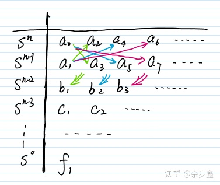
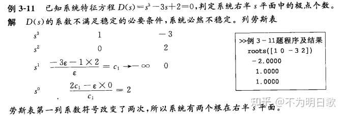

# 劳斯判据(Routh Criterion)

用以判断高阶系统稳定性（我堂堂赫尔维茨怎么不在标题里？）

:::warning 注意

赫尔维茨定理说了，线性系统想要稳定首先要**特征方程各项系数为正数**，可别**出现0或者负数**的时候还在列劳斯表判断稳定性

:::

:::info简单结论

- 一阶系统和二阶系统稳定的充分必要条件是：特征方程所有系数均为正

- **三阶系统稳定的充分必要条件是：特征方程所有系数均为正，且$a_1a_2>a_0a_3$**

:::

## 简介

> **劳斯–赫尔维茨稳定性判据**（英语：Routh–Hurwitz stability criterion）是[控制理论](https://zh.wikipedia.org/wiki/控制理论)中的一个数学判据，是[线性](https://zh.wikipedia.org/wiki/線性系統)[时不变系统](https://zh.wikipedia.org/wiki/时不变系统)（LTI）[稳定](https://zh.wikipedia.org/wiki/穩定多項式)的充分必要条件。劳斯测试是由英国数学家[爱德华·劳斯](https://zh.wikipedia.org/w/index.php?title=愛德華·勞斯&action=edit&redlink=1)在1876年提出的快速算法，可以判断一[线性系统](https://zh.wikipedia.org/wiki/線性系統)其[特征方程式](https://zh.wikipedia.org/wiki/特徵方程式)的[根](https://zh.wikipedia.org/wiki/根_(数学))是否都有负的实部[[1\]](https://zh.wikipedia.org/zh-cn/劳斯–赫尔维茨稳定性判据#cite_note-1)。德国数学家[阿道夫·赫维兹](https://zh.wikipedia.org/wiki/阿道夫·赫維茲)在1895年独立的提出将多项式的系数放到一个方阵中（此方阵称为[赫维兹矩阵](https://zh.wikipedia.org/wiki/赫維茲矩陣)），证明多项式稳定当且仅当赫维兹矩阵的主要子矩阵其行列式形成的数列均为正值[[2\]](https://zh.wikipedia.org/zh-cn/劳斯–赫尔维茨稳定性判据#cite_note-2)。二个程序是等价的，而劳斯测试提供一个有效计算赫维兹行列式的方法。满足劳斯–赫尔维茨稳定性判据的多项式称为[赫尔维茨多项式](https://zh.wikipedia.org/wiki/赫爾維茨多項式)[^1]

也就是说判据是两个人独立发现的，一个人列表一个人列矩阵，我们平时好像用劳斯表多点，虽然计算很简单，但是记忆还比较困难，而且证明繁琐，所以基本没有教材会解释，只是说结论

:::note

有关劳斯判据证明的文章：[劳斯判据如何证明? - 知乎 (zhihu.com)](https://www.zhihu.com/question/358628249)

:::

## 应用

:::info

这里先直接给出一个例题回顾一下

:::

来源：[劳斯稳定判据的数学应用(重点)](https://zhuanlan.zhihu.com/p/374466146)

## 使用方法

- 从高阶项系数开始写，按**先上后下，先左后右**的形式组成前两行表格
- 从第三行开始，每个元素来自上两行，将**第一列元素配上右上方元素**，构成行列式，最后**除以上一行的第一个元素**

:::caution 注意

构成的行列式要**加一个负号**，也就是说**左下乘以右上，减去左上乘以右下**，和正常算行列式来说是反的。

:::

图源：[（十三）判断稳定性：劳斯判据 - 知乎 (zhihu.com)](https://zhuanlan.zhihu.com/p/355436161)

:::warning结论

线性系统稳定的充分必要条件是：**劳斯表中第一列各值为正**。如果劳斯表第一列中出现了小于0的值，系统就不稳定，第一列个系数**符号的改变次数**，**代表了**特征方程的**正实部根的个数**

:::

## 特殊情况

### 某一行全为0

有时虚轴上的极点会造成临界稳定的情形。在那种情形中，**“劳斯表”的系数一整行都会变为零**，因而不能进一步求解出符号的改变了。然后另一种方法可以发挥作用。我们可以通过含有零的这一行的上面一行列出**“辅助多项式”**。

下面是一个例子：
$$
s^6+2s^5+8s^4+12s^3+20s^2+16s+16=0
$$
可得以下的表格：

| $s^6$ | 1     | 8      | 20     | 16    |
| ----- | ----- | ------ | ------ | ----- |
| $s^5$ | **2** | **12** | **16** | **0** |
| $s^4$ | 2     | 12     | 16     | 0     |
| $s^3$ | 0     | 0      | 0      | 0     |

在这个例子中，第四行为全零行，则利用第三行构建辅助多项式为
$$
A(s)=2s^4+12s^2+16
$$
下一步是对上面的方程求导，得到下面的多项式
$$
B(s)=8s^3+24s
$$
包含零的行现在变为 "8" 和 "24"。使用这些值继续建立劳斯表，就会得出虚轴上的两个点。这两个虚轴上的点是边缘稳定性的主要原因。

:::info

这里所说的虚轴上的点可以通过解辅助方程$A(s)=0$得到的。

:::

| $s^6$ | 1             | 8      | 20     | 16    |
| ----- | ------------- | ------ | ------ | ----- |
| $s^5$ | **2**         | **12** | **16** | **0** |
| $s^4$ | 2             | 12     | 16     |       |
| $s^3$ | **8**         | **24** |        |       |
| $s^2$ | 6             | 16     |        |       |
| $s^1$ | $\frac{8}{3}$ |        |        |       |
| $s^0$ | 16            |        |        |       |

:::note

同样使用上文应用小节中的长除法，可以得到原式除以A(s)后的余式为
$$
\frac{1}{2}s^2+s+1
$$
所以其还有两个共轭复跟为$-1\pm i$，具有负实部，系统稳定

:::

:::info

其实像表中$s^4$行，有公因数2，可以直接约成1、6、8，不会影响判断结果，但是不知道考试的时候能不能这么简化

:::

### 某行第一个元素为0但该行不全为0

图源：[劳斯判据（二阶情形与特殊情形分析）](https://zhuanlan.zhihu.com/p/422556097)

这个时候需要用一个无穷小的数（这里是用$\epsilon$）来代替0，继续进行接下来的运算

[^1]: [劳斯–赫尔维茨稳定性判据 - 维基百科](https://zh.wikipedia.org/zh-cn/劳斯–赫尔维茨稳定性判据)