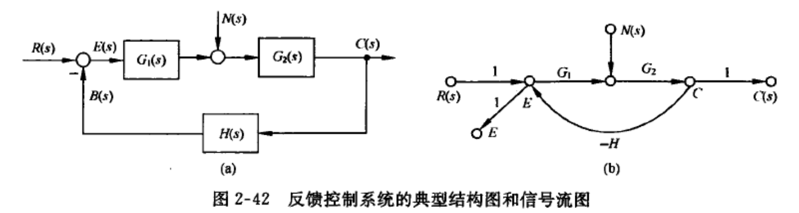

# 第二章——控制系统的数学模型

讨论时域和复数域的数学模型

## 引言

**控制系统的数学模型**描述的是系统内部物理量（或变量）之间的数学关系

- 静态数学模型：描述变量间关系的**代数**方程
- 动态数学模型：描述变量各阶导数之间关系的**微分**方程

目的是对系统做性能分析

模型的建立方法：

- 分析法：根据物理化学规律等写出相应的运动方程（本章所用方法）
- 实验法：人为给定输入，记录其输出响应，并用适当的数学模型去逼近

常用的数学模型：（本章研究加粗部分）

- 时域：**微分方程**、差分方程、状态方程
- 复数域：**传递函数、结构图**
- 频域：频率特性

## 2-1 控制系统的时域数学模型

重点研究**线性、定常、集总参量**控制系统

### 1. 线性元件的微分方程

- 确定输入和输出
- 根据物理、化学规律写出微分方程
- 想去中间变量，得到输出与输入的微分方程

### 2. 控制系统的微分方程

- 由系统原理图画图系统方块图
- 分别列写各元件的微分方程

> 可以发现，RLC无源网络和弹簧-质量-阻尼器机械系统的数学模型均是二阶微分方程，我们称这些物理系统为相似系统

### 3. 线性系统的基本特性

- 可叠加性
- 均匀性

> 这说明可以把激励单独处理，大大简化了研究

### 4. 线性定常微分方程的求解

拉氏变换法

- **考虑初始条件**，对每一项进行拉氏变换，得到关于s的代数式
- 有代数方程求出拉氏变换函数的表达式
- 拉氏反变换到的时域方程解

### 5. 非线性方程的线性化

切线法

- 把f(x)在某一点泰勒展开，仅保留一次项
- 对多变量函数也同样处理

:::info

感觉有点像把各个维度解耦了，并且只按切线/切平面来做计算

:::

### 6. 运动的模态

> 如果n阶微分方程的特征根**存在**，则对应得到的**e指数函数解**就是微分方程所描述运动的**模态**，又称**振型**

每一种模态都代表一种类型的运动状态，齐次微分方程的通解就是模态的线性组合

:::caution注意

共轭复模态$e^{\sigma+j\omega}$和$e^{\sigma-j\omega}$可以写成实函数模态$e^{\sigma t}sin\omega t$与$e^{\sigma t}cos\omega t$的形式

:::

## 2-2 控制系统的复数域数学模型

传递函数非常重要，是根轨迹、频率法的基础，同时还可以研究结构变化对系统性能的影响

### 1. 传递函数的定义和性质

==定义==

- **线性定常系统**的传递函数，定义为**零初始状态**下，系统输出量的拉氏变换与输入量的拉氏变换之比

==性质==

- 传递函数是复变量s的**有理真分式**，具有复变函数的所有性质
- 传递函数值取决于系统和元件的结构与参数，与**输出量无关**
- 传递函数与微分方程有相通性$s\rightarrow \frac{d}{dt}$
- 传递函数G(s)的反变换为脉冲响应h(t)

### 2. 传递函数的零点和极点

略

### 3. 传递函数零极点对输出的影响

传递函数极点——微分方程的特征根——决定了系统自由运动的模态——强迫运动中也会包含这些自由运动的模态

如
$$
G(s)=\frac{C(s)}{R(s)}=\frac{6(s+3)}{(s+1)(s+2)}
$$
自由运动的模态是$e^{-t}$和$e^{-2t}$

当$r(t)=R_1+R_2e^{-5t}$时
$$
\begin{aligned}
c(t) & =\mathscr{L}^{-1}[C(s)] \\
& =\mathscr{L}^{-1}\left[\frac{6(s+3)}{(s+1)(s+2)}\left(\frac{R_1}{s}+\frac{R_2}{s+5}\right)\right] \\
& =9 R_1-R_2 \mathrm{e}^{-5 t}+\left(3 R_2-12 R_1\right) \mathrm{e}^{-t}+\left(3 R_1-2 R_2\right) \mathrm{e}^{-2 t}
\end{aligned}
$$
式中，**前两项具有与输入函数 $r(t)$ 相同的模态**，后两项中包含了由极点 -1 和 -2 形成的**自由运动模态**。这**是系统“固有” 的成分**，但**其系数却与输入函数有关**，因此可以认为这两项**是受输入函数激发**而形成的。

>传递函数的**极点可以受输入函数的激发，在输出响应中形成自由运动的模态。**

> 传递函数的**零点并不形成自由运动的模态，但是他们影响模态在响应中的比重**

零点如果距离原点远、离极点近，则对应模态所占比重就小

### 4. 典型元部件的传递函数

- 电位计
  - 负载效应
- 测速发电机
- 电枢控制直流伺服发电机
- 两相伺服电动机
- 无源网络
  - 可能需要考虑负载效应（两个电路直接链接器传递函数不是简单相乘）
  - C的复阻抗为$\frac{1}{Cs}$，L的复阻抗为Ls
- 单容水槽（一阶过程）
- 电加热炉（一阶过程）
- 有纯延迟的单容水槽（多了延时因子）
- 双容水槽（二阶过程）

## 2-3 控制系统的结构图和信号流图

### 1. 系统结构图的组成和绘制

四种基本单元

- 信号线
- 引出点（测量点）
- 比较点（综合点）
- 方框（环节）

### 2. 结构图的等效变换和简化

这个过程对应于方程消去中间变量求系统传递函数的过程

- 串并联

- **反馈**
  - **负号**对应**正反馈**，**正号**对应**负反馈**

$$
\Phi(s)=\frac{G(s)}{1 \mp G(s) H(s)}
$$

### 3. 信号流图的组成和性质

信号流图起源于梅森用图示法来描述一个或一组线性代数方程式，它是有节点和支路组成的一种信号传递网络

:::note

只有**节点和支路**两种成分，而结构图有四种基本单元

:::

性质：

- 节点标志系统的变量
- 支路相当于乘法器
- 信号在支路上只能沿单箭头传递
- **给定系统的信号流图不是唯一的**

名词术语

- 源节点（输入节点）/陷节点（输出节点）
- 混合节点
- 前向通路——信号**从输入节点到输出节点**传递时，**每个节点只通过一次**的通路
  - 前向通路增益——$P_k$
- 回路——**起点和终点在同一节点**，而且信号**通过每一节点不多于一次**的闭合通路
  - 回路增益——$L_a$
- 不接触回路——回路之间没有公共节点

### 4. 信号流图的绘制

- 从系统微分方程——每个变量指定一个节点
- 从结构图——把传递的信号用小圆圈表示

- 信号流图的简化

支路增益为1（-1）的相邻两个节点，一般可以合并为一个节点，上图中的$M_s$和$M_m$可以合并成一个节点，变量是$M_s-M_m$

> 例：绘制下述系统结构图的信号流图
>
> 

>
> 可以先按顺序画出中间通路，再补齐上下的分支
>
> 

### 5. 梅森增益公式

本质上是应用了克莱姆法则求解方程组，表述为
$$
P=\frac{1}{\Delta} \sum_{k=1}^n p_k \Delta_k
$$
其中分母多项式为：
$$
\Delta = 1-\sum L_u+\sum L_b L_c-\sum L_d L_e L_f+\cdots
$$

- $\sum L_a$ 表示信号流图中**所有单独回路**的回路增益之和项
- $\sum L_b L_c$ 表示信号流图中**每两个互不接触的回路**增益之乘积的和项
- $\sum L_d L_e L_f$ 为所有互不接触的单独回路中，每次取**其中三个回路**的回路增益的乘积之和

分子中

- $p_k$ 是**第 $k$ 条前向通路总增益**
- $\Delta_k$ 是与第 $k$ 条前向通路对应的**余因子式**
  - 等同系数行列式$\Delta$中**去掉与第$k$条前向通路接触的所有回路**的回路增益项之后的余子式

> 例：
>
> 

>
> ---
>
> 

> 例：
>
> 

>
> :::tip
>
> 先画流图，再计算
>
> :::
>
> 

> 例：
>
> **求X4/X1和X2/X1**
>
> 

>
> ---
>
> X4/X1：
>
> 

>
> X2/X1：
>
> :::caution注意
>
> 求X2/X1的时候仍然是一样的用法
>
> :::
>
> 

> 例：
>
> 

>
> :::caution注意
>
> 这里有四个回路，且存在三个回路互不相交，所以有$\sum L_d L_e L_f$项
>
> :::
>
> 

### 6. 闭环系统的传递函数

有时候我们需要**研究扰动$N(s)$对系统输出$C(s)$的影响，或是以误差$E(s)$为输出量**，所以我们在画流图的时候可以画**多个源节点或陷节点**：

（1）**输入信号**作用下的**闭环传递函数**（以$R(s)$作输入）
$$
\Phi(s)=\frac{C(s)}{R(s)}=\frac{G_1(s) G_2(s)}{1+G_1(s) G_2(s) H(s)}
$$
（2）**扰动**作用下的**闭环传递函数**（以$N(s)$作输入）
$$
\Phi_n(s)=\frac{C(s)}{N(s)}=\frac{G_2(s)}{1+G_1(s) G_2(s) H(s)}
$$
（3）**输入和扰动同时作用下的系统输出**（叠加原理）
$$
\begin{aligned}
\sum C(s) & =\Phi(s) \cdot R(s)+\Phi_n(s) \cdot N(s) \\
& =\frac{1}{1+G_1(s) G_2(s) H(s)}\left[G_1(s) G_2(s) R(s)+G_2(s) N(s)\right]
\end{aligned}
$$
上式如果满足 $\left|G_1(s) G_2(s) H(s)\right| \gg 1$ 和 $\left|G_1(s) H(s)\right| \gg 1$ 的条件, 则可简化为
$$
\sum C(s) \approx \frac{1}{H(s)} R(s)
$$
:::caution注意

此时，系统的输出值只取决于反馈通路传递函数$H(s)$和输入信号$R(s)$

既与前向通路传递函数无关, 也不受扰动作用的影响。**【深度负反馈】**

特别是当 $H(s)=1$, 即**单位反馈**时, $C(s) \approx R(s)$, 从而近似**实现了对输人信号的完全复现**, 且**对扰动具有较强的抑制能力**。

:::

（4）闭环系统的误差传递函数
$$
\Phi_e(s)=\frac{E(s)}{R(s)}=\frac{1}{1+G_1(s) G_2(s) H(s)}
$$

$$
\Phi_{e n}(s)=\frac{E(s)}{N(s)}=\frac{-G_2(s) H(s)}{1+G_1(s) G_2(s) H(s)}
$$

:::tip

注意到本例中**各种闭环系统传递函数**的**分母形式均相同**，这是因为它们都是同一个信号流图的特征式，即$\Delta=1+G_1(s) G_2(s) H(s)$, 式中 $G_1(s) G_2(s) H(s)$ 是回路增益，上述系统的**开环传递函数**, 它**等效为主反馈断开时，从输入信号 $R(s)$ 到反馈信号 $B(s)$ 之间的传递函数**（只断开反馈，但是不删除下面的$H(s)$）

:::

