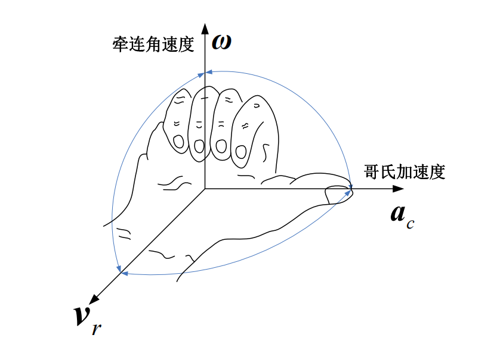
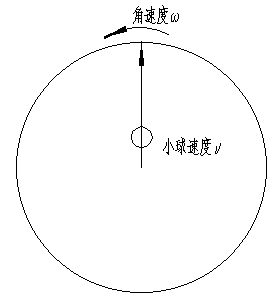
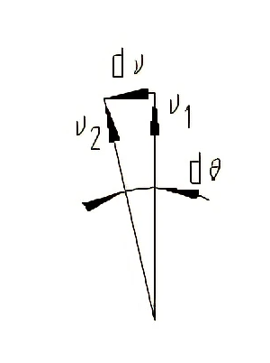
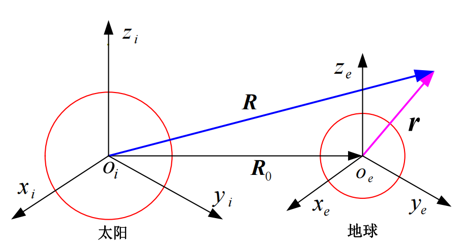
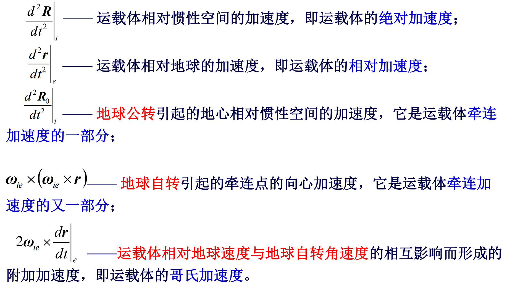

# 哥氏加速度和绝对加速度

研究运载体在地球表面附近航行的绝对加速度

:::caution结论
$$
\left.\frac{d^2 \boldsymbol{R}}{d t^2}\right|_i=\left.\frac{d^2 \boldsymbol{R}_0}{d t^2}\right|_i+\left.\frac{d^2 \boldsymbol{r}}{d t^2}\right|_e+2 \omega_{i e} \times\left.\frac{d \boldsymbol{r}}{d t}\right|_e+\boldsymbol{\omega}_{i e} \times\left(\boldsymbol{\omega}_{i e} \times \boldsymbol{r}\right)
$$
:::

从运动学知，当动点相对某一动参考系作相对运动，同时这个动参考系又在做牵连转动时，则该动点将具有哥氏加速度$a_c$：
$$
\boldsymbol{a}_c=2 \boldsymbol{\omega} \times \boldsymbol{v}_r
$$

> 这个加速度的实际是惯性的表现，可以理解为两方面
>
> 当小球沿杆向远离圆心的方向移动时：
>
> 
>
> - 半径增大，切向速度大小需要增大
> - 圆盘旋转，法向速度方向需要改变
>
> 
>
> 当动点的**牵连运动为转动**时，**牵连运动会使相对速度的方向不断发生改变**，而**相对运动又使牵连速度的大小不断发生改变**。这两种原因都造成了**同一方向上附加的速度变化率**，该附加的速度变化率即为哥氏加速度。简而言之，哥氏加速度是由于**相对运动与牵连运动的相互影响**而形成的。
>
> [参考来源：知乎——怎样简易的理解科氏加速度？](https://www.zhihu.com/question/37384392?sort=created)

## 绝对加速度

当动点的牵连运动为转动时，动点的绝对加速度应等于相对加速度、牵连加速度与哥氏加速度的矢量和：
$$
\boldsymbol{a}=\boldsymbol{a}_r+\boldsymbol{a}_e+\boldsymbol{a}_c
$$
下面讨论**运载体在地球表面附近航行时所受的加速度**

这里选取太阳为惯性系（虽然实际上也不是），地球的坐标系在惯性空间内有平移和旋转，飞行器在地球坐标系下的矢径是r

对$R=R_0+r$求两次导之后的结果为：
$$
\left.\frac{d^2 \boldsymbol{R}}{d t^2}\right|_i=\left.\frac{d^2 \boldsymbol{R}_0}{d t^2}\right|_i+\left.\frac{d^2 \boldsymbol{r}}{d t^2}\right|_e+2 \boldsymbol{\omega}_{i e} \times\left.\frac{d \boldsymbol{r}}{d t}\right|_e+\boldsymbol{\omega}_{i e} \times\left(\boldsymbol{\omega}_{i e} \times \boldsymbol{r}\right)
$$

> 第一次求导：
> $$
> \left.\frac{d \boldsymbol{R}}{d t}\right|_i=\left.\frac{d \boldsymbol{R}_0}{d t}\right|_i+\left.\frac{d \boldsymbol{r}}{d t}\right|_i
> $$
> 其中
> $$
> \left.\frac{d \boldsymbol{r}}{d t}\right|_i=\left.\frac{d \boldsymbol{r}}{d t}\right|_e+\boldsymbol{\omega}_{i e} \times \boldsymbol{r}
> $$
> 它表示了**向量的绝对变率和相对变率的关系**，称为**哥氏方程**，也叫哥氏转动坐标定理
>
> 在固定坐标系中，一个向量对时间的变化率（**绝对变化率**）**等于**同一向量在动坐标系中对时间的变化率（**相对变化率**）与**动坐标系对固定坐标系的旋转角速度向量和该向量本身的向量积**之和。
>
> 【后面一项看起来有点像$v=\omega*r$】
>
> 最后的方程为
> $$
> \left.\frac{d \boldsymbol{R}}{d t}\right|_i=\left.\frac{d \boldsymbol{R}_0}{d t}\right|_i+\left.\frac{d \boldsymbol{r}}{d t}\right|_e+\boldsymbol{\omega}_{i e} \times \boldsymbol{r}
> $$
> 第二次求导：
> $$
> \frac{d}{d t}\left(\left.\frac{d \boldsymbol{R}}{d t}\right|_i\right)_i=\left.\frac{d^2 \boldsymbol{R}}{d t^2}\right|_i
> $$
>
> $$
> \frac{d}{d t}\left(\left.\frac{d \boldsymbol{R}_0}{d t}\right|_i\right)_i=\left.\frac{d^2 \boldsymbol{R}_0}{d t^2}\right|_i
> $$
>
> $$
> \frac{d}{d t}\left.\left(\left.\frac{d \boldsymbol{r}}{d t}\right|_e\right) \right|_i=\frac{d}{d t}\left.\left.\left(\left.\frac{d \boldsymbol{r}}{d t}\right|_e \right)\right|_e+\omega_{i e} \times\left.\frac{d \boldsymbol{r}}{d t}\right|_e=\left.\frac{d^2 \boldsymbol{r}}{d t^2}\right|_e+\omega_{i e} \times\left.\frac{d \boldsymbol{r}}{d t}\right|_e\right.
> $$
>
> $$
> \left.\frac{d\left(\boldsymbol{\omega}_{i e} \times \boldsymbol{r}\right)}{d t}\right|_i=\boldsymbol{\omega}_{i e} \times\left.\frac{d \boldsymbol{r}}{d t}\right|_i+\left.\frac{d \boldsymbol{\omega}_{i e}}{d t}\right|_i \times \boldsymbol{r}
> $$
>
> 其中比较难搞的是第三行的式子，但是可以把
> $$
> \frac{d \boldsymbol{r}}{d t}
> $$
> 整体理解为一个在旋转坐标系中的矢量（实际也就是速度在地球坐标系中），然后再用哥氏方程。
>
> 最终得到的绝对加速度方程为：
> $$
> \left.\frac{d^2 \boldsymbol{R}}{d t^2}\right|_i=\left.\frac{d^2 \boldsymbol{R}_0}{d t^2}\right|_i+\left.\frac{d^2 \boldsymbol{r}}{d t^2}\right|_e+2 \omega_{i e} \times\left.\frac{d \boldsymbol{r}}{d t}\right|_e+\boldsymbol{\omega}_{i e} \times\left(\boldsymbol{\omega}_{i e} \times \boldsymbol{r}\right)
> $$

其中：

