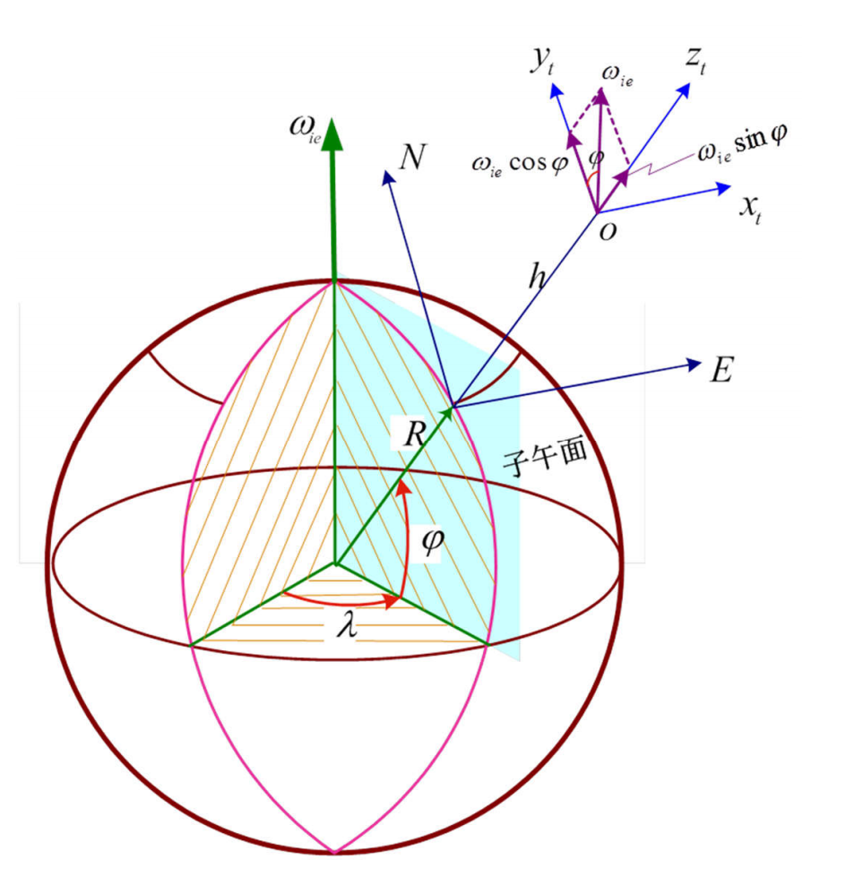
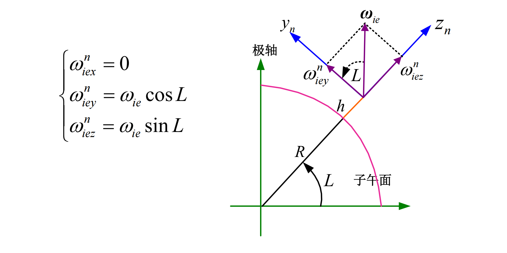
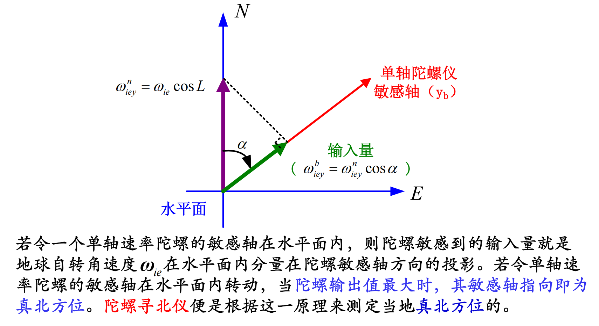

# 寻北仪

介绍寻北仪工作原理

## 简介

> 寻北仪是用来寻找某一位置的真北方位。
>
> 陀螺寻北仪又称陀螺罗盘。

## 工作原理

地球存在自转，自转角速度方向为地轴正北方向

将自转角速度投影到地理坐标系，则：
$$
\left\{\begin{array}{l}
\omega_{i e x}^n=0 \\
\omega_{i e y}^n=\omega_{i e} \cos L \\
\omega_{i e z}^n=\omega_{i e} \sin L
\end{array}\right.
$$

:::caution注意

地理坐标系的Y轴指向正北，所以$\omega_{ie}$在YOZ平面内，在X轴上没有分量

:::

如果垂直于子午面来看

在水平面上看的话，因为角速度在x轴上没有分量，所以如果有陀螺仪来敏感加速度，那么当陀螺仪输出最大的时候，敏感轴的指向就是正北方向。

它的寻北过程无需外部参考，不受天气、昼夜时间、地磁场等条件的影响。

:::caution注意

实际寻北的过程也不需要去寻找输出最大的位置，可以通过依次转动固定角度，然后通过列方程计算的形式来得到陀螺敏感轴与真北方向的夹角。
$$
\left\{\begin{array}{l}
\omega_1=\omega_{i e} \cos L \cos \alpha+\varepsilon \\
\omega_2=-\omega_{i e} \cos L \sin \alpha+\varepsilon \\
\omega_3=-\omega_{i e} \cos L \cos \alpha+\varepsilon \\
\omega_4=\omega_{i e} \cos L \sin \alpha+\varepsilon
\end{array}\right.
$$

$$
\alpha=\arctan \left(\frac{\omega_4-\omega_2}{\omega_1-\omega_3}\right)
$$

:::

用此方法测量，**可以消除陀螺的零偏，也不需要知道测量地点的纬度值**。如果测量地点的纬度 为已知值，那么可以只需测量1和3(或者2和4)两个位置便可以求出航向角，即
$$
\alpha=\arccos \left(\frac{\omega_1-\omega_3}{2 \omega_{i e} \cos L}\right)
$$

$$
\alpha=\arcsin \left(\frac{\omega_4-\omega_2}{2 \omega_{i e} \cos L}\right)
$$

