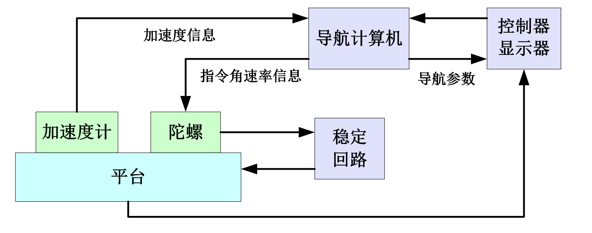
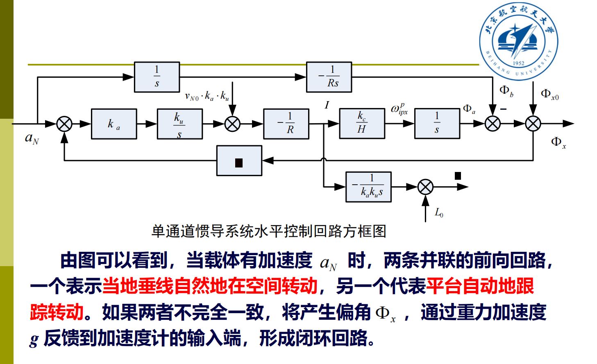
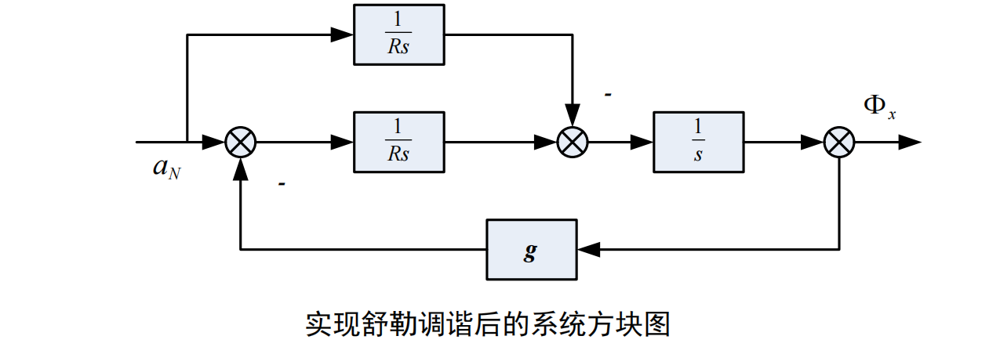

# 平台式惯导系统

基本原理、组成

## 基本原理

- 核心是一个**陀螺稳定平台**，确定了一个平台坐标系

该坐标系精确模拟了某一选定的导航坐标系，可以提取出载体相对于导航坐标系加速度矢量的三个分量

通过两次积分得到速度和位置

- 平台上**装有三个单自由度陀螺和三个加速度计**

要想让平台在一定的工作时间内始终保持在地理坐标系内，必须给陀螺力矩器施加力矩，使平台进动，跟踪地理坐标系的运动。

:::note

不同方案的平台式惯导系统，其组成**结构是相似的**，**区别主要是选用的导航坐标系不同**，因而导航参数与指令角速率的计算过程不同，即**力学编排方程不同。**

:::

## 需要解决的问题

- 如何由**比力**信息**提取**出所需**加速度**信息
- 如何进行平台指令角速度及导航参数的**计算**
- 如何使平台回路满足**舒勒调谐**
- 如何进行精确的**初始对准**

### 1. 比力方程回顾

又是熟悉的比力方程：
$$
f=\dot{v}_{e p}+\left(2 \omega_{i e}+\omega_{e p}\right) \times v_{e p}-g
$$
**比力=相对+牵连+哥氏-重力**

其中：

- $e$为地球坐标系，$p$为平台坐标系，他们均为非惯性系，$i$是地球惯性系
- $\dot{v}_{e p}$ 为平台相对地球坐标系的加速度，是惯导系统所要提取的信息
- $v_{ep}$可以由$\dot{v}_{e p}$积分得到
- 地球自转角速度$\omega_{ie}$已知
- 坐标系相对地球旋转角速度$\omega_{e p}=v_{ep}/R$
- **如果平台精确跟踪当地水平坐标系**，$g$在水平面上的分量为0
- 比力$f$由加速度计直接得到

### 2. 惯性平台的控制（水平通道）

惯性平台的运动：

- 平动——由平台**稳定回路**实现
- 转动——由平台**修正回路**实现

以单通道惯导系统为例：

要求：**模拟当地地理坐标系**（水平面坐标系的一种）

硬件：加速度敏感轴为**正北方向**，陀螺仪敏感轴为**正东方向**

具体控制过程：

- 加速度计发现载体在以加速度$a_N$沿子午线向北航行时，当地垂线的方向不断变化，变化的瞬时角速度为$-\frac{V_N}{R}$,其中$V_N$可以通过加速度积分得到
- 为了使平台能够跟踪地垂线的变化，计算机应向陀螺提供相同的指令角速率信息$\omega_{i p x}^p=-\left(v_N / R\right)$

- 角速率信号转化为电流传递给平台控制力矩，产生的力矩使平台进动进而跟踪地理坐标系

### 3. 平台的舒勒调谐条件

**如果通过设计使两个并联的前向回路的传递函数完全相等，即满足：**
$$
\frac{k_a k_u k_c}{H}=1
$$
则无论加速度 $a_N$ 为何值，两条前向回路的作用始终互相抵消，恒有 $\Phi_a-\Phi_b=0$ 。只要严格初始对准使 $\Phi_{x 0}=0$ ，则平台将始终跟踪当地水平面，反馈回路将不起作用。

> **所以（2）式就是平台水平控制回路的舒勒调谐条件，他是通过调整传递系数实现舒勒调谐的。**

### 4. 惯导系统高度通道的问题

如果平台跟踪了水平面，那么高度通道上重力加速度的分量应该就是他本身，不过注意到重力也是高度的函数，所以也要列写相应的方程

分析特征方程后发现系统有正根，误差会随时间发散，因此，不能直接采用纯惯性的高度通道，而必须引入外部高度信息进行组合，使系统获得必要的阻尼后再求高度。

> 纯惯性的高度通道是不稳定的，必须引入外部（**气压高度表、无线电高度表、大气数据系统等**）的高度信号来对高度通道构成阻尼回路，这样可以得到**动态品质较好而误差又不随时间发散**的组合高度系统。