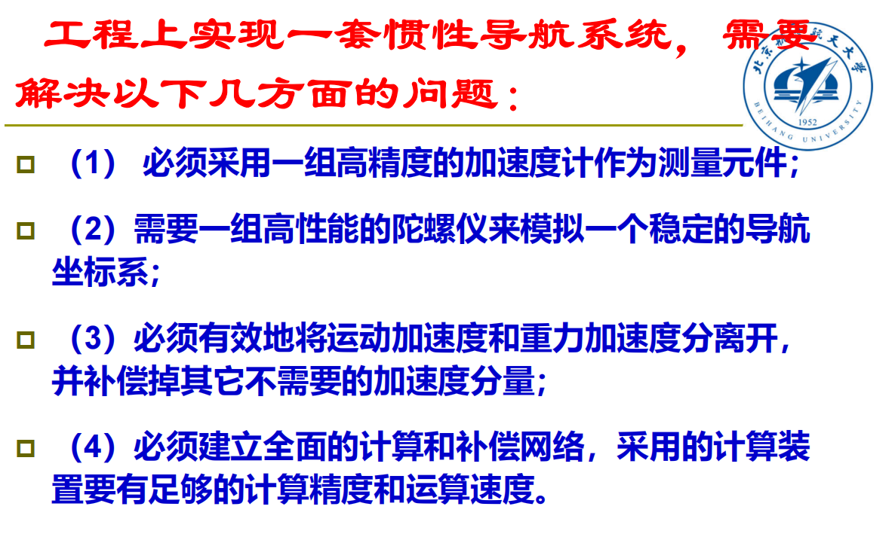

# 惯导重要概念

导航、惯导优点、工程问题、组成分类

## 导航（Navigation）

导航是引导运载体达到预定目的地的过程

## 惯导优越性

- 高度的自主性，能独立完成工作

## 基本工作原理

- 根据牛顿定律，利用一组加速度计连续地进行测量，从中提取运动载体相对某一选定的导航坐标系的加速度信息；

- 通过一次积分运算便得到载体相对导航坐标系的即时速度信息；
- 再通过一次积分运算便又得到载体相对导航坐标系的即时位置信息。

## 工程上的关键问题

**（1） 必须采用一组高精度的加速度计作为测量元件**

- 因为如果不加任何调整，则加速度计测量的常值误差将会造成随时间平方增长的位置误差。

**（2）需要一组高性能的陀螺仪来模拟一个稳定的导航坐标系**

- 因为载体的加速度、速度和位置都是矢量，且矢量的运算只能分解到具体坐标系的三个轴上才能进行

**（3）必须有效地将运动加速度和重力加速度分离开，并补偿掉其它不需要的加速度分量。**

- 因为加速度计不能区分所测得的是载体的运动加速度还是重力加速度及混杂的其它分量

$$
\vec{f}=\dot{\vec{v}}+\vec{\omega}_{e p} \times \vec{v}+2 \vec{\omega}_{i e} \times \vec{v}-\vec{g}
$$

$$
\left(2 \vec{\omega}_{i e}+\vec{\omega}_{e p}\right) \times \vec{v}-\vec{g}=\vec{a}_B
$$

$$
\vec{f}-\vec{a}_B=\dot{\vec{v}}
$$

- 有两种方法将运动加速度和重力加速度分开
  - 通过计算对重力加速度分量进行直接补偿，那就必须引入一个相当复杂的重力场模型
  - 用陀螺平台跟踪一个当地水平坐标系，使两个水平加速度计的测量轴与台面重合，这样便可**避免感受重力而间接地补偿掉重力加速度分量**

**（4）必须建立全面的计算和补偿网络，采用的计算装置要有足够的计算精度和运算速度**

- 从加速度信息到位置信息的两次积分运算
- 为提取信息而进行的补偿运算（向心加速度及哥氏加速度）
- 线量转换为角量的运算
- 方向余弦矩阵的计算，即完成各有关的坐标系间的坐标变换
- 对陀螺仪和加速度计的常值及随机误差进行统计计算，以作为下次工作补偿的依据。

:::caution总结

:::

## 惯导系统的组成

1. 惯导测量组件（包括加速度计和陀螺仪）
2. 惯导平台
3. 导航计算机
4. 控制显示器

## 惯导系统的分类

1. 平台式惯性导航系统（**根据平台所模拟的坐标系的不同**，又分为空间稳定惯导系统和当地水平面惯导系统）
   1. **空间稳定惯导系统**——空间稳定惯导系统的平台台体相对惯性空间稳定，用来模拟某一惯性坐标系
   2. **当地水平面惯导系统**——当地水平面惯导系统的平台台体则模拟某一当地水平坐标系
      1. 指北方位惯导系统（模拟当地地理坐标系）
      2. 自由方位惯导系统
2. 捷联式惯性导航系统（省去了惯性平台的台体，代之以存贮在计算机中的“数学平台”）