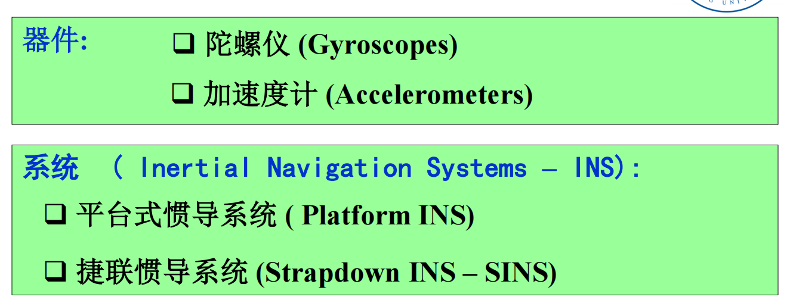
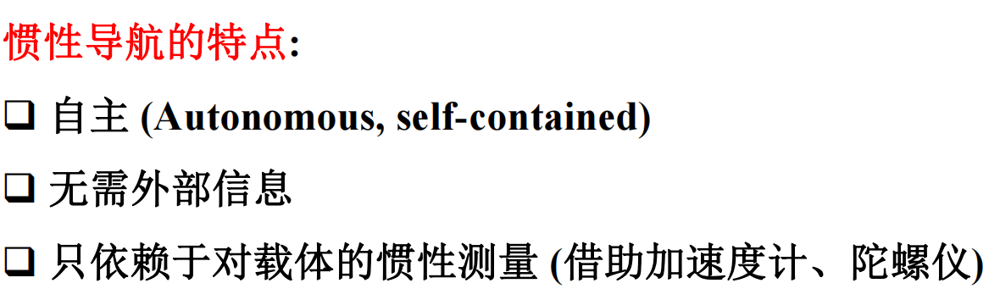
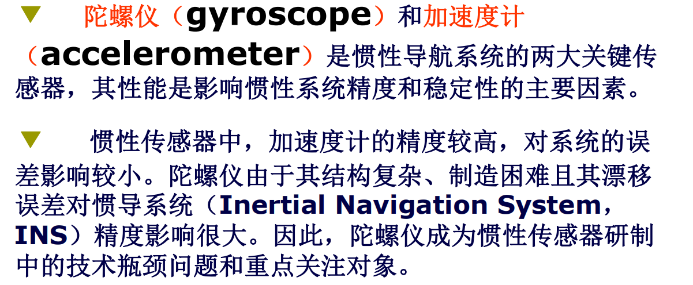

# 绪论

导航、惯导绪论

## 导航系统的分类

是否能独立产生导航信息：

- 自主导航
- 无线电导航

具体种类：

- 惯性导航
- 卫星导航
- 天文导航
- 物理场导航

## 导航系统优缺点

### 无线电导航

有卫星导航、多普勒导航等

优点：

- 不受时间、天气限制，精度高，作用距离远，定位时间短，设备简单可靠

缺点

- 必须辐射和接收无线电波而容易被发现和干扰，需要载体外的导航台支持

### 惯导系统

优点：

- 无需依赖任何外界信息，只依靠陀螺仪和加速度计这两种惯性仪表
- 不受外界干扰，隐蔽性好，无法被反利用，不受环境限制
- 提供的导航数据十分完整，除了载体的位置和速度外，还可以提供航向和姿态信息
- 数据更新率高、短期精度和稳定性好

缺点

- 单独使用时误差会随时间积累，需要其他导航方法对误差定期矫正

## 惯导发展历程

80年代，在计算机与现代控制理论发展的推动下，由“数学平台”取代机电框架平台的捷联惯导系统得到了迅猛发展。

进入90年代，以捷联式惯导系统为主的组合导航系统在各种运载体中的应用不断扩大

在军事领域内，惯导系统和以惯导为主的组合导航系统始终处于主导地位。

## 惯导系统的分类

根据有无机电实体平台：

- 平台式
  - 空间稳定惯性导航平台
  - 当地水平面惯性导航平台 
- 捷联式

按选用陀螺仪类型：

- 经典力学：

  - 液浮陀螺

  - 三浮陀螺

  - 挠性陀螺

- 非经典力学

  - 静电陀螺

  - 激光陀螺

  - 光纤陀螺

装备对象

- 舰载
- 机载
- 车载

## 惯性技术分类

- 惯性导航技术
- 惯性制导技术
- 惯性器件技术
- 惯性测试技术

## 陀螺仪发展历程

- 单自由度旋转陀螺（1920年，精度低）
- 液浮陀螺（50-80年代）
- 静电陀螺（加工要求高，价格贵）
- 动力调谐挠性陀螺（响应快，抗振动冲击性差）
- 光学陀螺有两种：一种是激光陀螺，另一种是光纤陀螺，后者更简单便宜
- 微机械惯性仪表（MEMS）：非常小，但精度低

## 总结

