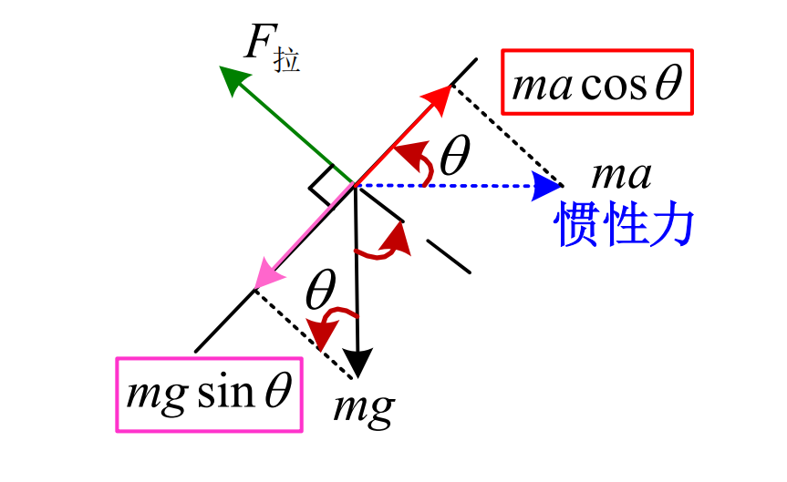

# 舒勒原理

舒勒摆与舒勒原理

## 问题引入

在惯性导航系统中，**惯导平台要求精确地跟踪当地水平面**（也就是**惯导平台的垂直轴**必须**精确跟踪当地垂线**），以便精确的给出加速度的基准。

**怎么实现？**

——利用单摆来指示垂线

### 普通摆如何指示垂线

在载体上挂一个单摆时，如果载体静止或匀速直线运动，则单摆的平衡位置可以指示垂线方向

但是当载体作**加速运动**的时候，单摆的平衡位置**不能**指示地垂线，而是偏离了一个角度，此时单摆受到了加速度干扰

**能否让单摆不受加速度干扰？**

### 不受加速度干扰的单摆

参考：[奇妙的舒勒周期84.4分钟 - 刘延柱的博文](https://blog.sciencenet.cn/blog-3452605-1269981.html)

- 一方面，有加速度时单摆会偏移一个角度
- 另一方面，地球是圆的，向前移动时地垂线也会偏移

可以猜想到，当摆长于地球半径相同时，**不管支点如何移动**，都不会影响摆锤及其平衡位置，即单摆始终指示地垂线而不受加速度的干扰【**舒拉原理**】

:::tip

铅锤方向的加速度不会干扰单摆的平衡位置，但水平方向的加速度会使单摆振动。若要单摆不受影响，**必须使单摆的摆长具有地球半径的长度**，这种单摆称为舒勒摆。可知这种单摆的固有震荡周期为**84.4min**

:::

## 相关定义

### 舒勒原理

一个指示垂线的系统，如果其固有震荡周期为84.4min，则当运载体在地球表面易任意方式移动时，此装置将不受运载体加速度的干扰。

### 舒勒调谐

通过选择参数使得一个指示垂线的装置满足舒勒原理的条件，称为舒勒调谐

## 实际意义

只有使惯性导航系统成为舒勒调谐的系统，惯导系统才能不受运载体加速度的影响始终精确的跟踪当地水平面

## 证明过程

### 一、分析受力

### 二、分析力矩

建立摆角**微变**方程

**设单摆偏移竖直线的角度为$\theta$**

- 重力产生的力矩：$mglsin\theta$
- 惯性力产生的力矩：$malcos\theta$

设单摆的转动惯量为$J$，则：
$$
J \ddot{\theta}_\alpha=m l a \cos \theta-m g l \sin \theta
$$

> 注意其中$\theta_\alpha$和$\theta$的区别，如下图，设支点**从I运动一小段时间后来到了II的位置**，则$\theta_\alpha$指的是相对于之前地垂线的偏角，而$\theta$是相对于现在地垂线的偏角，$\theta_b$是他们的差，他们之间满足关系
> $$
> \left.\begin{array}{l}
> \alpha_{\mathrm{a}}=\alpha_{\mathrm{b}}+\alpha \\
> \ddot{\alpha}_{\mathrm{a}}=\ddot{\alpha}_{\mathrm{b}}+\ddot{\alpha}
> \end{array}\right\}
> $$
> 
> 

已知：
$$
J \ddot{\theta}_\alpha=m l a \cos \theta-m g l \sin \theta
$$
其中
$$
\ddot{\theta}_\alpha=\ddot{\theta}_b+\ddot{\theta}=\frac{a}{R}+\ddot{\theta}\\
cos\theta\approx1\ ,\ sin\theta\approx\theta
$$
则：
$$
\ddot{\theta}+\frac{m g l}{J} \theta=\left(\frac{m l}{J}-\frac{1}{R}\right) a
$$
