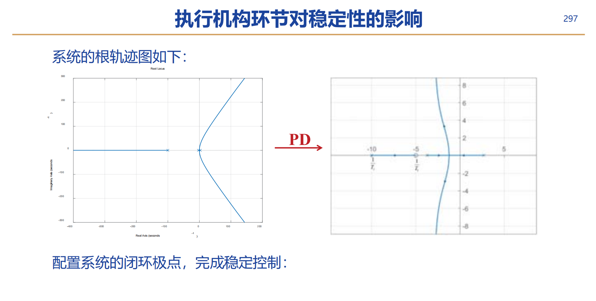
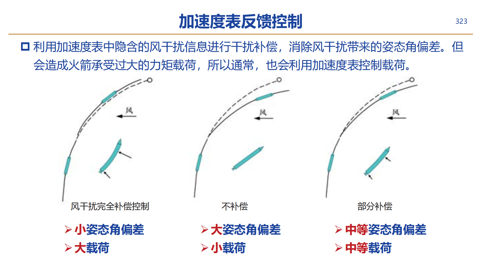
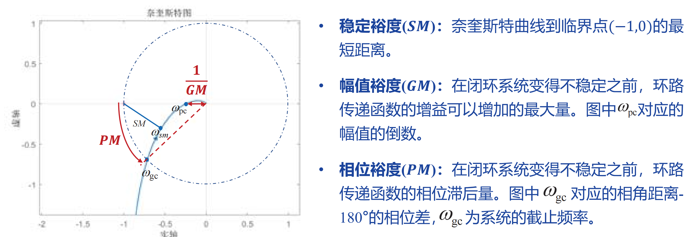

# 刚体火箭控制器设计

## 四个火箭姿控的性能指标

他们相互联系、互相制约

- 稳定性指标
  - 绝对稳定性——极点位置
  - 相对稳定性——动态特性品质和裕度
- 动态性能指标
  - 过渡时间、超调量、振荡次数满足要求
- 跟踪精度指标
  - 满足小扰动条件
- 抗干扰指标
  - 低频干扰——补偿、抵消
  - 高配干扰——抑制、衰减

## 姿态控制器设计

设计策略——基于误差来消除误差，采用线性框架下的PID控制

仅仅一个P会使系统有较大振荡（虽然稳定了）

引入D（微分控制），消除振荡，但存在稳态误差

引入I（积分控制），将系统由二阶系统改造为一阶系统，对阶跃指令无稳态误差（不过积分会降低相位裕度）

## 复合控制：反馈加前馈

在反馈的基础上添加前馈回路，可以减小稳态控制误差，不影响系统稳定性

风干扰误差，可以通过PD->PID消除，也可以通过前馈消除

风干扰可以通过前馈完全补偿，但是可能会导致箭体内部载荷过大而使箭体折断，因此只能补偿一部分风干扰

但是前馈控制只能补偿这种有模型的误差，去掉积分环节会使其他的很多干扰不能补偿

可以通过控制回路中增加**扩张状态观测器**，对干扰进行在线估计，然后消除估计出的干扰力矩

## 姿控系统的鲁棒性

### 鲁棒性指标

当参数（或结构）存在某种程度的不确定性时，系统仍能保证稳定性

- 稳定裕度（SM）奈奎斯特曲线到临界点（-1,0）的最短距离
- 幅值裕度（GM）在闭环系统变得不稳定之前，环路传递函数的增益可以增加的最大值，是奈奎斯特曲线与x轴负方向交点对应幅值$\omega_{pc}$的倒数
- 相位裕度（PM）在闭环系统变得不稳定之前，环路传递函数的相位滞后量，是系统截止频率$\omega_{ga}$对应的相角距离-180°的相位差

良好的系统相位裕度在40°左右，幅值裕度应该大于6dB

### 灵敏度函数

可以表示反馈（闭环）对开环的影响，他即是稳态误差的度量，也是抗扰性的度量

灵敏度极大值越大，系统稳定裕度越低

灵敏度极大值越小，其各项指标也越优异，但是灵敏度的最小值也有（可用带宽）限制

## 可用带宽

高带宽一般意味着高成本，对于有限带宽的系统，其灵敏度函数满足伯德积分

如果干扰衰减在一个频段上得到了改善，那么 他必然会在另一个频段上变差

系统的可用带宽增加，敏感度极大值下降，稳定裕度增加

根据经验，可用带宽是不稳定极点的十倍以上