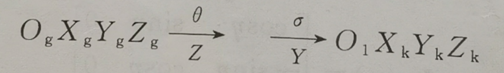
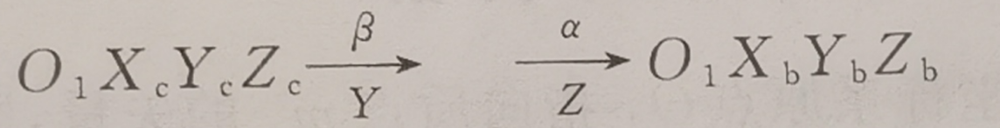
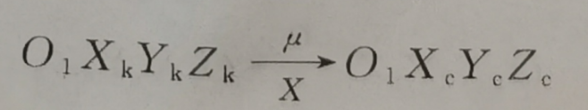
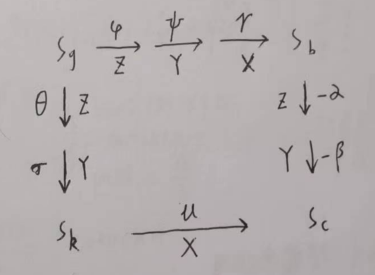
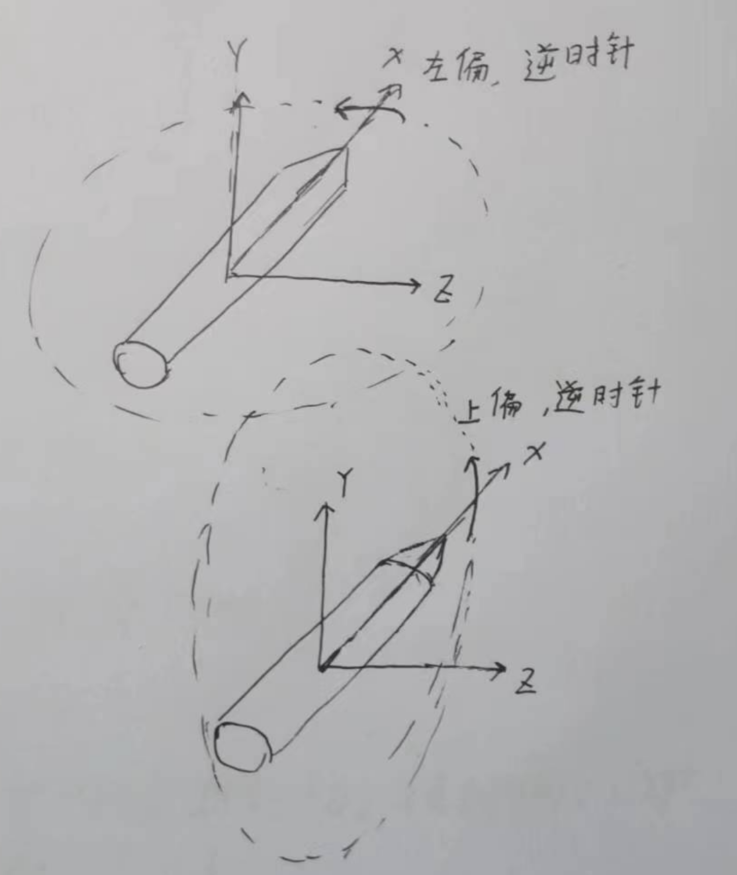

# 坐标系之间的转换

四个主要坐标系之间的转换

## 四个坐标系和三组角度

详见[常用坐标系](./常用坐标系)和[飞行器姿态的表示](./飞行器姿态的表示)

- 发射点坐标系$S_g$
- 本体系$S_b$
- 速度坐标系$S_c$
- 弹道坐标系$S_k$

---

- 姿态角——俯仰角$\phi$、偏航角$\psi$、滚转角$\gamma$
- 气流角——攻角$\alpha$、侧滑角$\beta$
- 弹道角——弹道倾角/速度倾角$\theta$、弹道偏角/航向角$\sigma$

## 转换关系

### $S_g$到$S_b$

### $S_g$到$S_k$

### $S_c$到$S_b$

### $S_k$到$S_c$

这里出现了一个没有见过的角度$\mu$，我们回顾坐标系定义可知，$S_k$和$S_c$的x轴都是速度矢量方向，不同的是y轴

- $S_k$关注于飞行器弹道，所以y轴与“飞行器当前位置的铅垂面”内
- $S_c$关注于飞行器姿态，所以y轴在“飞行器当前纵平面”内

这么一看，他们的变换关系确实应该就是绕x轴旋转了一个角度，把原本在“铅垂面”内的y轴转到了“纵平面”内

> $\mu$的物理含义：飞行器的主升力方向（纵平面内）与当地铅垂面之间的夹角
>
> 对于面对称的升力体飞行器（如飞机），横侧向速度方向的改变主要依靠主升力面产生的升力（依靠滚转改变主升力方向，产生横侧向升力），此时$\mu$表示的就是升力用于横侧向机动的分量大小
>
> 对于轴对称的旋成式飞行器（如火箭、弹头），由于过弹体纵轴的各个截面面积相同，在横侧向机动时无需调整滚动姿态将升力进行横侧向投影，这种情况下一般保持弹体滚动稳定，不考虑倾侧角，即$\mu=0$

## 转换关系总结

:::caution注意

书上的攻角侧滑角是从$S_c$系转换到$S_b$系时为正，如果反过来转换的话，相应的角度也应该变成负的

这个可以结合角度的定义来理解，当时我们发现**只有攻角和侧滑角是向下、向右为正，俯仰角和偏航角、弹道倾角和弹道偏角，都是向上、向左为正**，结合下面这个图

我们可以发现，在本体系中看的话，**向上、向左**分别代表着Y轴逆时针转、和Z轴逆时针转，逆时针方向**为正**，所以此时旋转角度是正的。

**只有从$S_b$到$S_c$的时候是负的**

:::
