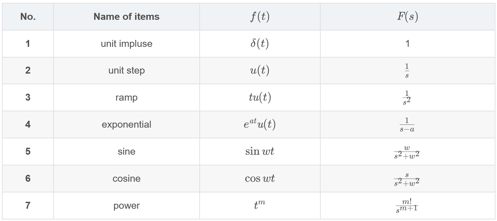
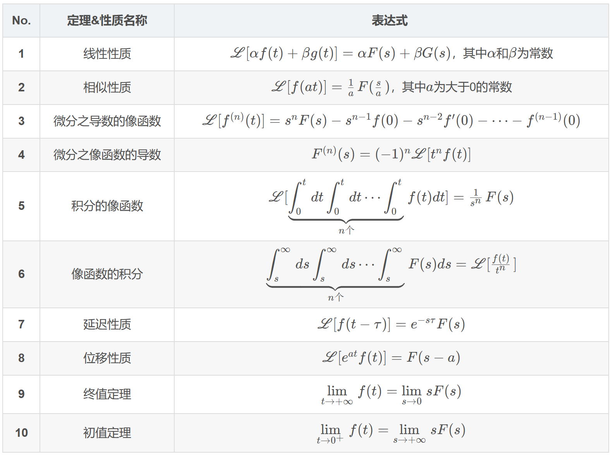

# 拉普拉斯变换

一直在用但又一直记不住……

> 参考网站：[拉普拉斯变换与拉普拉斯逆变换的常用结论与经典公式](https://blog.csdn.net/wh_STUDY/article/details/126403817)

:::note定义式
$$
F(s)=\int_0^{+\infty} f(t) e^{-s t} d t
$$

$$
f(t)=\mathscr{L}^{-1}[F(s)]=\frac{1}{2 \pi j} \int_{\beta-j \infty}^{\beta+j \infty} F(s) e^{s t} d s
$$

:::

## 参考表

## 相关性质

