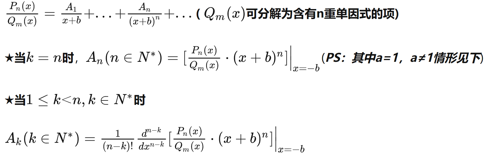

# 不定积分(indefinite integral)

反思一下你漏洞百出的数理基础！

:::tip

不定积分被定义为原函数的全体

:::

## 原函数存在定理

- f(x)在区间I上**连续**，则f(x)在I上**一定存在**原函数
- f(x)在区间I上有第一类间断点，则f(x)在区间I上没有原函数

:::caution

如果f(x)有第二类间断点，也可以存在原函数。换句话说，**f(x)存在原函数不能推出f(x)连续**。

另外因为原函数一定可导，所以**原函数必连续**

:::

## 基本公式

我觉得反过来记比较好记，所以这里给出某些常见函数的导数

:::warning注意

但是求原函数别忘了加常数C

:::

---

$$
tan\ x'=sec^2x\\cot\ x'=-csc^2x\\sec\ x'=sec\ xtan\ x\\csc\ x'=-csc\ xcot\ x\\
$$

----

$$
arcsin\ x'=\frac{1}{\sqrt{1-x^2}}\\
arctan\ x'=\frac{1}{1+x^2}\\
$$

----

$$
(arcsin\ \frac{x}{a})'=\frac{1}{\sqrt{a^2-x^2}}\\
(arctan\ \frac{x}{a})'=\frac{a}{a^2+x^2}\\
$$

:::note

**注意arctan的分子还有个a**

:::

---

$$
\int sec\ xdx=ln|sec\ x+tan\ x|+C\\
\int csc\ xdx=-ln|csc\ x+cot\ x|+C\\
$$

## 固定套路

:::tip 说明

下面的题目出自2024版武忠祥 高等数学基础篇 和 基础过关660题

:::

### 1. 换元法

- 某部分明显是某一函数的导数

- 代换式中带根号部分

> **尝试一下：**
> $$
> \int \frac{2-x}{\sqrt{3+2x-x^2}}dx
> $$
> 提示：令m=x-1，对形如$\int\frac{x}{\sqrt{ax^2+b}}dx$的形式要敏感，x可以拿到dx里变成$\frac{1}{2}xdx=dx^2$
>
> ---
>
> $$
> \int \sqrt{\frac{3-2x}{3+2x}}dx
> $$
>
> 提示：直接令$t=\sqrt{\frac{3-2x}{3+2x}}$，代换后只剩下关于t的多项式了
>
> ---
>
> $$
> \int \sqrt{1+e^x}dx
> $$
>
> 提示：直接令$t=\sqrt{1+e^x}$，则$x=ln(t^2-1)$，代换后也只剩下关于t的多项式了

:::caution注意

上面的第二小问是形如
$$
\int R\left(x,\sqrt[n]{\frac{ax+b}{cx+d}}\right)dx
$$
的简单无理函数积分，统一方法就是用t直接替换。一般根号里的分式是齐次的时候会比较好解。

:::

- 含有$\sqrt{a^2-x^2}$，则令$x=asint$或$x=acos\ t$，则原式=$acos\ t$，$dx=acos\ t\ dt$
- 含有$\sqrt{a^2+x^2}$，则令$x=atan\ t$，则原式=$asec\ t$，$dx=asec^2t\ dt$
- 含有$\sqrt{x^2-a^2}$，则令$x=asec\ t$，则原式=$atan\ t$，$dx=asec\ t\ tan\ t\ dt$

> **尝试一下：**
> $$
> \int \frac{x^2}{\sqrt{a^2-x^2}}dx
> $$
>
> ---
>
> $$
> \int \frac{\sqrt{x^2+a^2}}{x^2}dx
> $$
>
> ---
>
> $$
> \int \frac{\sqrt{x^2-a^2}}{x}dx
> $$

### 2. 分部积分法

:::info

重点在于凑出导数

:::

- 多项式与e指数、$sinax$、$cosax$相乘，把后者放入dx
- e指数与$sinax$、$cosax$相乘，把e指数凑入dx
- 多项式与$lnx$、$arcsinx$、$arctanx$，把多项式凑入dx

> **尝试一下：**
> $$
> \int \frac{ln\ x}{(1-x^2)}dx
> $$
>
> ---
>
> $$
> \int \frac{ln\ sinx}{sin^2x}dx
> $$

### 3. 有理多项式分式的拆分

:::info

使用留数法计算各项系数可以大幅简化计算

:::

[留数法实现有理分式拆分原理 - 知乎 (zhihu.com)](https://zhuanlan.zhihu.com/p/336225471)

> 

### 4. 有理三角函数分式的积分

- $R(-sinx,cosx)=-R(sinx,cosx)$，则凑$dcosx$
- $R(sinx,-cosx)=-R(sinx,cosx)$，则凑$dsinx$
- $R(-sinx,-cosx)=R(sinx,cosx)$，则凑$dtanx$

## 补充题目

> 例1：$I_1=\int cos^4xdx$，$I_2=\int sin^4xdx$，求$I_1$、$I_2$
>
> 方法一：先算$I_1+I_2$、$I_1-I_2$，再分别算$I_1$、$I_2$
>
> 方法二：用二倍角公式两次展开

> 例2：计算$\int ln\left(1+\sqrt\frac{1+x}{x}\right)dx$
>
> 提示：令$t=\sqrt\frac{1+x}{x}$，转换成多项式乘ln的形式，再利用分部积分把ln去掉
