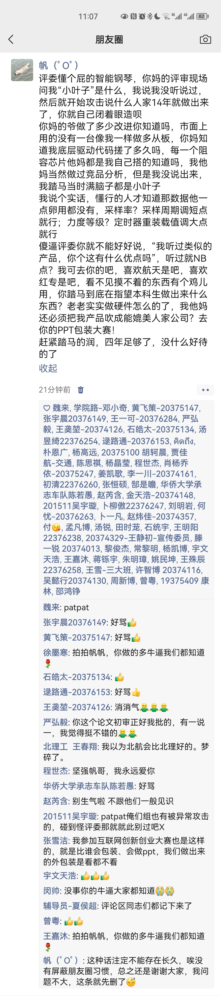
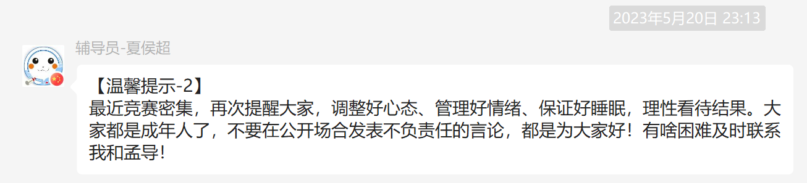
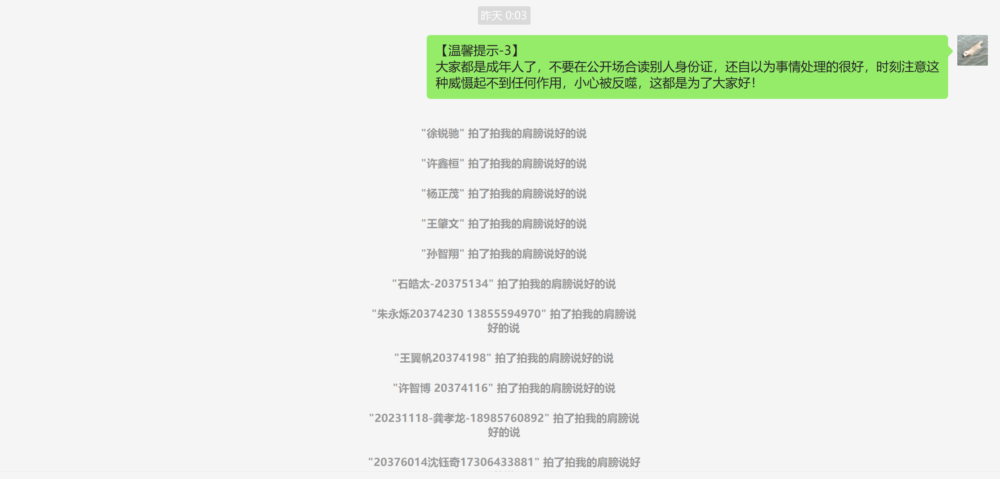
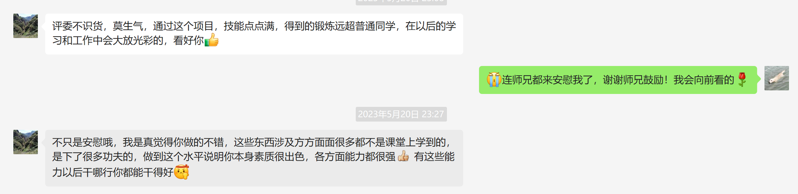

# 永远记得这一刻的耻辱

这是互联网上不为人知的一个角落，因为我没有留任何接口，只有输入网址才能访问这里。

现在是5月22日凌晨1点20，我睡不着。上大学以来，只有4次能有一件事让我如此烦躁揪心，前3次是因为女人，第四次是因为冯如杯。

永远记得这一刻，3分钟铃响，你像败犬一样走下了讲台！

5分钟是多么的自信，3分钟就是多么的失望

评委问你，有没有一套评价系统，你虽然解释了，但是听起来像是临时想起来的，他不知道你背后做过多少调研，尝试了多少方法，因为你当时很慌张，没有说的很清楚

评委问你会不会弹钢琴，你大方的承认不会，说但是我们项目有人会，你指了指成菲，但是她很不识趣的摇摇头，你本可以补一句“她有点谦虚，PPT里那个弹奏的人就是我们项目的，他更会弹一点“，他们也不知道你还请了学妹这样会弹钢琴的人来弹。

评委说人家早就有现成产品了，你知不知道，不知道就闭着眼造呗。你慌了，你没有听过他所说的小叶子，你只能说"我觉得我们的项目做的还挺好的"，他不知道你的项目其实是别人的延伸，他不知道你按照自己思路完全重构了整个系统，他不知道其中的技术要点，他不知道你熬了多少大夜做了多少改进，他不知道你花了多少个日夜去看别人的项目，他不知道其实那些公司也有虚假宣传，这是内行人才能看的懂的话题

失策了，你把宝押在了别人不知道类似系统的基础上，你听从老师意见删掉了关于其他项目的所有介绍，但这让人感到你在避重就轻。

失策了，因为学院答辩时你前前后后都在对比别人项目，评委没有提出相关问题，让你以为在学校答辩中也不会有这些问题。

失策了，你本可以靠你的机智和口才把一切挽救回来，但是那时的你只是一只大脑空白的败犬。

项目答辩前，你多少次和别人提过，我才不想进一等奖答辩，直接项目结束发个二等奖算了。你也多次对答辩表现出漫不经心，认为只是大学和人生中的一件小事，你在意的只是怎么做好自己工作，怎么把项目更加完善。

他们不知道你用了多少天去尝试队列，只为实现串口的透传，这明明是开个大数组就能解决的问题；他们不知道你用了多少天去开发自编码算法、去写交互界面、去研究IIC通信、去焊电路板、去改电路图、去研究MATLAB文档、去查阅MIDI文献、去看电磁铁驱动、去写校准算法、去做脚踏板采集、去分析音频信号。他们打心底里看不起你的项目，因为这是别人做过的东西，这是市面上成熟的东西，存在即是原罪，即便是你从零开始实现了它。

网络太过嘈杂，这些东西不能、没有必要存在在公众网络上。但是网络他有记忆，这是只有你知道的网址，不要想着公开他，但也绝对不要忘记这一刻的耻辱。

你真的以为自己不在乎，直到你看到了一等奖答辩名单。你身边的两个人，你明知道的没有你做的多的两个人，你坚信会比他们做的好的那两个人，进了一等奖答辩。看到的那一刻，感觉不是很对劲。你默默走出了寝室，一路无言。

你编辑了很久，将自己的想法发到了朋友圈，痛骂了评委，但是你也知道虽然他们是最主要原因，但是还有你队员的不给力，你准备的不充分。

这种话不能存在于公开场合，你边哭边在学校里漫无目的的踱步，很快辅导员就打来了电话，你知道他是想来干什么的，他只是想让你删个朋友圈。

他先是好话，后是坏话，再又是好话，几番变脸，你早就知悉了这就是他常用的伎俩。

[通话录音](./188%201304%204212_20230520225057.m4a)

你心如死灰，但是理解别人的不易，最后你还是提出了删掉朋友圈，即便是想让更多的人知道你的痛。挂掉电话，仍在留念，几分钟后评论区出现了辅导员不痛不痒的玩笑话，一点也不好笑，但是你知道是时候删掉朋友圈了。

又是一路啜泣，但是微信里出现了很多小红点。有学长语重心长的开导，有同学的安慰，还有鹿总要请我吃寿司。

感谢他的话，我又闷闷走了几分钟，还是收拾好情绪来到了他们寝室，他们很热情的迎接了我，分为炸虾和寿司，跟我开玩笑。我们彼此心照不宣，没有提太多答辩的事，也只是聊了聊结果

大概又过了十分钟，我回到了寝室，寝室里很多人围在子柯桌子旁讨论游戏。他们不懂我有多痛，虽然这个时候我最想听到的是问候，但是他们首先半开玩笑的问我，超导是不是给我打电话了。我很疑惑，问你们怎么知道的，他们说猜的啊，大班通知群里发的，我一猜就是

我承认辅导员是懂火上浇油的

“他妈的！！！！！！！！我现在就把朋友圈找回来！！！！！！！我踏马删个屁啊！！！！！！！！！”

你任凭情绪占据大脑，快递箱被撕开，手机直接砸出去，椅子也狠狠的甩到地上。在所有人反应过来之前，你捡起地上的手机打了辅导员电话。

第一个没接，你知道他开了免打扰，挂掉打了第二个

[通话录音1](./188%201304%204212_20230520233447.m4a)

显然他是蒙的，你挂断电话后他打回了一个电话

[通话录音2](./188%201304%204212_20230520233655.m4a)

你知道没什么好跟他沟通的了，第三个电话你没准备接，被智翔gg抢去接了

[通话录音3](./188%201304%204212_20230520233737.m4a)

也许你应该庆幸开了自动录音，让你能永远记下这一刻。

智翔回来了，寝室里人不知何时已经散了，大家都没有说话。

我默默带上耳机听起辅导员和智翔的电话，我知道他根本就没有关心我，甚至说我身体不好，多吃药。

笑，同等的反制必须要有

心情舒畅很多，另一种意义上我要感谢他成为我的出气口。

更多的人来问我缘由了，有的人在夸我good job，有的人在鼓励我，但是我知道没有人能理解我真正的痛。

我等了一整天，冯如杯的群里并没有什么动静，真正知道我干了多少活的人，都没有给我满意的回复。

成菲没有反思他在答辩现场的无力表现，也没有对我有实质性的鼓励

天浩的话稍微多一些

峰源仍然是他关键时刻不靠谱的样子，一句话没有说过

家俊本就不多说话，只是在我气到极致想喝水时给了我一瓶水

付老师进了一等奖答辩，他应该也知道自己说的话没有什么用

没有想到的是，师兄给了我莫大的鼓励，他提供给我的帮助，比老师本身给我的要多的多，刘老师自始至终，帮助基本是资金上的，我知道他对这个项目也不上心，即使我是这么努力。但是我也没有指望他给我任何技术帮助，他给我打钱，把师兄介绍给我，我也挺感激的。

记住这一刻，有人在安慰你，但是没有人懂你有多痛，没有人知道你到底多耻辱，你要继续努力，离开这个令人失望，不值得留念的地方。